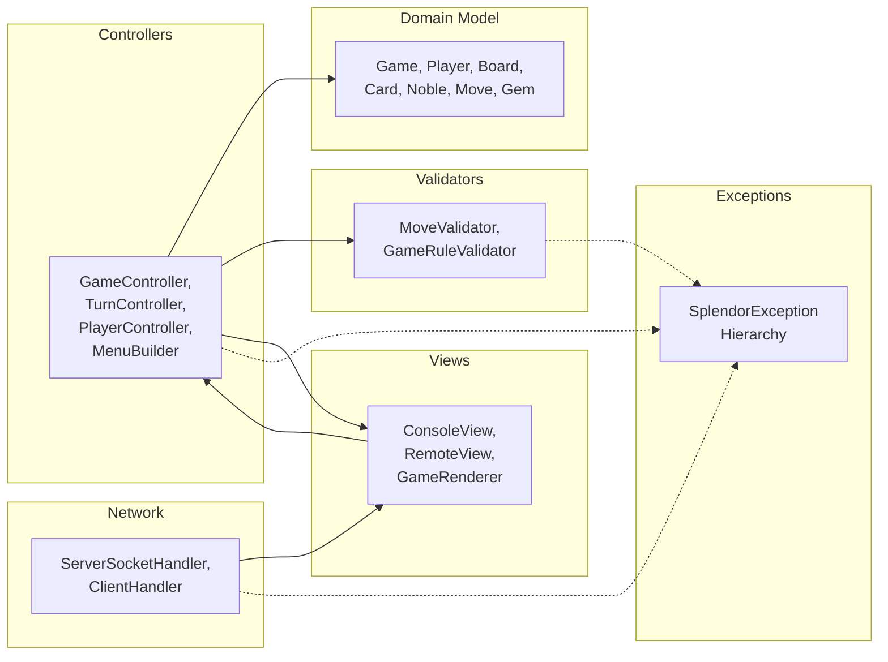
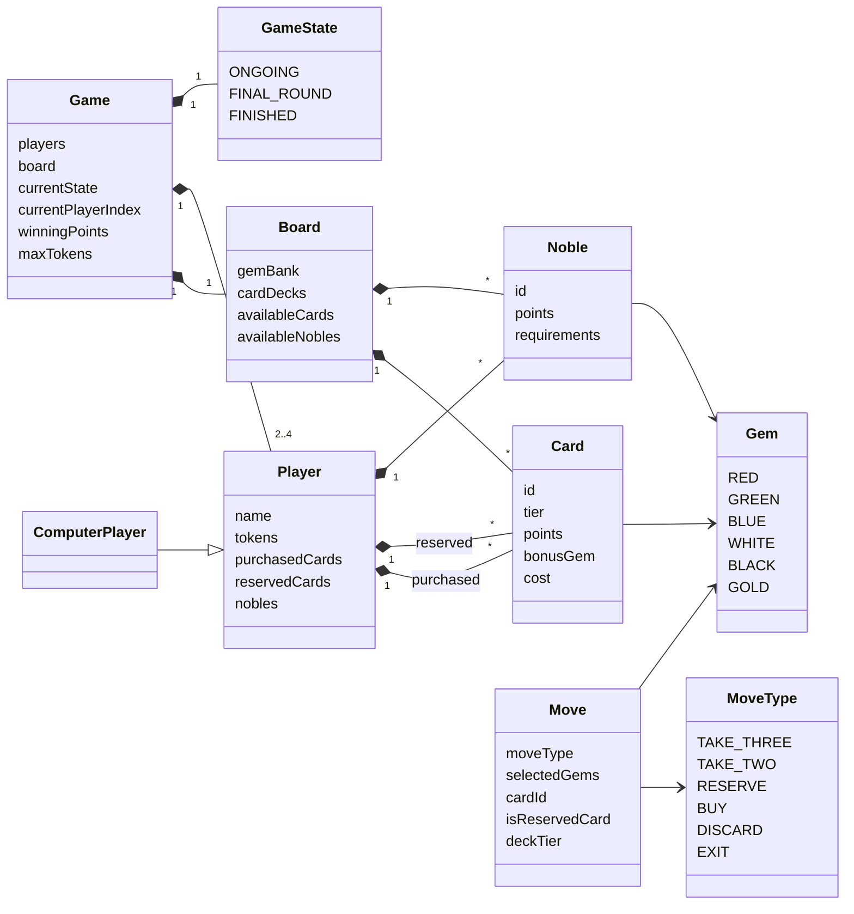
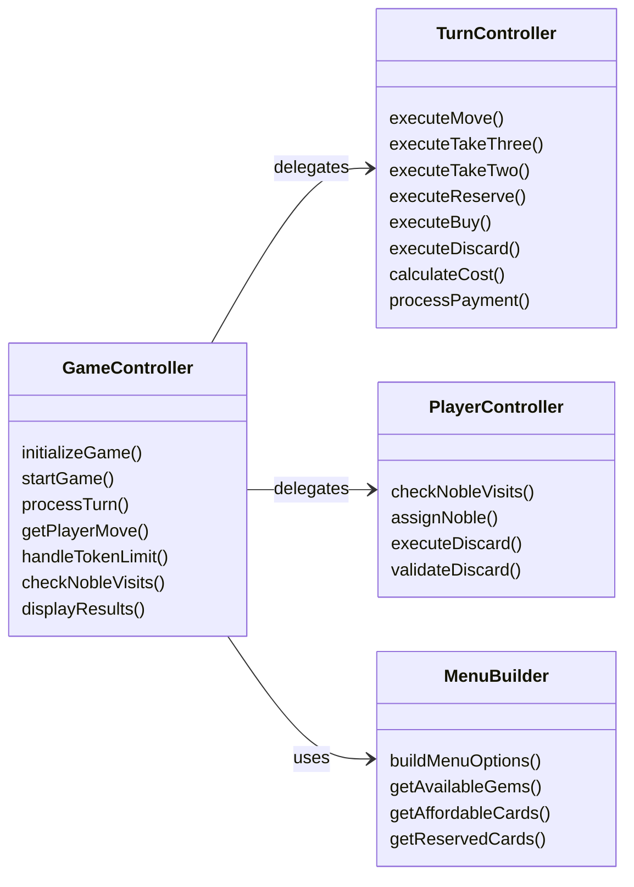
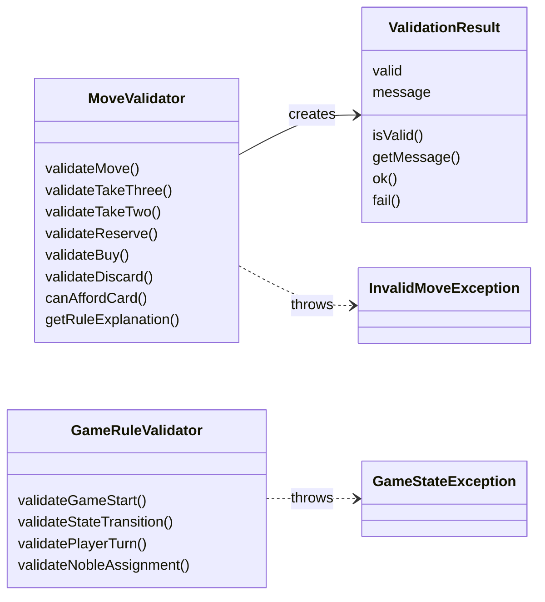
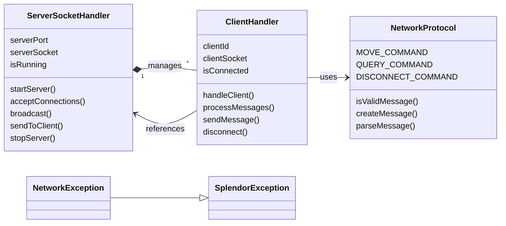
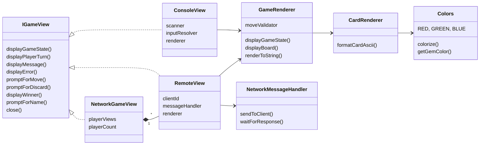
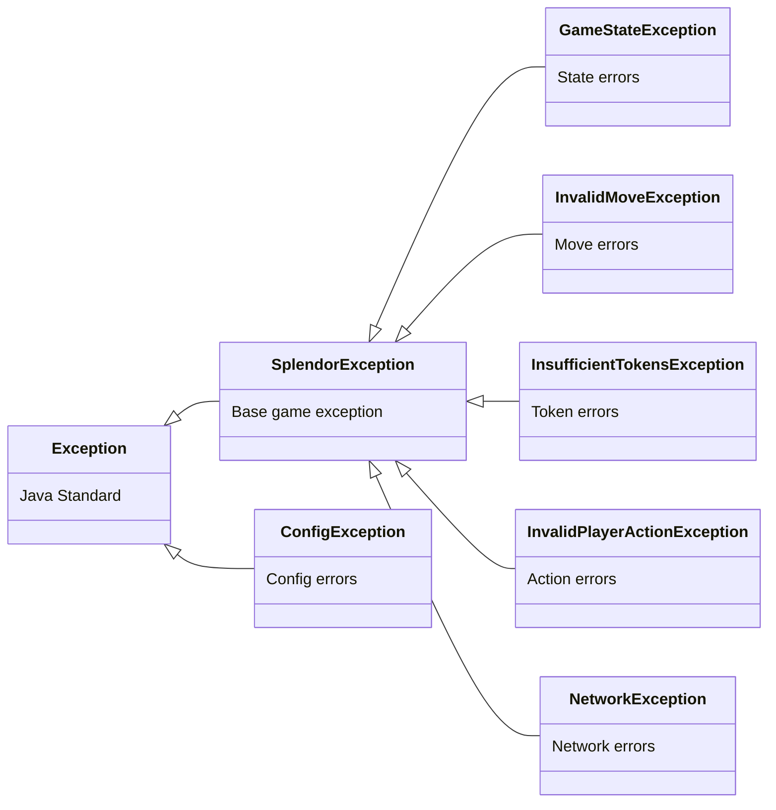

# 🎮 Splendor Java Implementation - Complete Architecture Documentation

---

## Table of Contents
1. [High-Level Architecture](#1-high-level-architecture)
2. [Complete Class List by Package](#2-complete-class-list-by-package)
3. [Six Category Diagrams](#3-six-category-diagrams)
   - 3.1 [Domain (Data Structure)](#31-domain-data-structure)
   - 3.2 [Controllers (Business Logic)](#32-controllers-business-logic)
   - 3.3 [Validators (Rule Checking)](#33-validators-rule-checking)
   - 3.4 [Network (Multiplayer)](#34-network-multiplayer)
   - 3.5 [Views (User Interface)](#35-views-user-interface)
   - 3.6 [Exceptions (Error Handling)](#36-exceptions-error-handling)
4. [How the Game Flows](#4-how-the-game-flows)
5. [Summary Table](#5-summary-table)
6. [Design Patterns](#6-design-patterns)
7. [Class Count Summary](#7-class-count-summary)

---

## 1. High-Level Architecture

This project follows a strict **MVC (Model-View-Controller)** architecture:



**Six Main Portions:**
1. **Domain** - Game entities and state
2. **Controllers** - Game flow orchestration
3. **Validators** - Move and rule validation
4. **Network** - Online multiplayer support
5. **Views** - Display and user interaction
6. **Exceptions** - Error handling hierarchy

---

## 2. Complete Class List by Package

### 📦 **com.splendor** (Entry Point)
| Class | Description |
|-------|-------------|
| `Main` | Application entry point |

### 📦 **com.splendor.config** (Configuration)
| Class | Type | Description |
|-------|------|-------------|
| `IConfigProvider` | Interface | Config reader interface |
| `FileConfigProvider` | Class | Loads from properties file |
| `ConfigKeys` | Class | Config key constants |
| `ConfigException` | Exception | Config loading errors |

### 📦 **com.splendor.exception** (Error Handling)
| Class | Extends | Description |
|-------|---------|-------------|
| `SplendorException` | `Exception` | Base game exception |
| `GameStateException` | `SplendorException` | Invalid state transitions |
| `InvalidMoveException` | `SplendorException` | Illegal player moves |
| `InsufficientTokensException` | `SplendorException` | Not enough gems |
| `InvalidPlayerActionException` | `SplendorException` | Invalid actions |

### 📦 **com.splendor.model** (Domain/Data)
| Class | Type | Description |
|-------|------|-------------|
| `Gem` | Enum | Token colors (6 types) |
| `MoveType` | Enum | Action types (6 types) |
| `MenuAction` | Enum | Menu options (7 types) |
| `GameState` | Enum | Game phases (3 types) |
| `Card` | Class | Development cards |
| `Noble` | Class | Noble visitors |
| `Player` | Class | Player data |
| `ComputerPlayer` | Class | AI player |
| `Board` | Class | Game board |
| `Game` | Class | Game session |
| `Move` | Class | Player actions |
| `MenuOption` | Class | Menu items |
| `BotStrategy` | Class | AI logic |

### 📦 **com.splendor.model.validator** (Validators)
| Class | Description |
|-------|-------------|
| `MoveValidator` | Validates moves |
| `GameRuleValidator` | Validates game rules |
| `ValidationResult` | Validation results |

### 📦 **com.splendor.controller** (Controllers)
| Class | Description |
|-------|-------------|
| `GameController` | Main orchestrator |
| `TurnController` | Executes moves |
| `PlayerController` | Player logic |
| `MenuBuilder` | Builds menus |

### 📦 **com.splendor.network** (Multiplayer)
| Class | Description |
|-------|-------------|
| `ServerSocketHandler` | TCP server |
| `ClientHandler` | Client manager |
| `NetworkProtocol` | Message protocol |
| `NetworkException` | Network errors |

### 📦 **com.splendor.util** (Utilities)
| Class | Description |
|-------|-------------|
| `Constants` | Game constants |
| `GameLogger` | Logging |
| `AnsiUtils` | ANSI colors |
| `CardLoader` | Load cards |
| `GemParser` | Parse gems |
| `InputResolver` | Input handling |
| `MoveFormatter` | Format moves |
| `MoveParser` | Parse moves |

### 📦 **com.splendor.view** (Views)
| Class | Type | Description |
|-------|------|-------------|
| `IGameView` | Interface | View contract |
| `ConsoleView` | Class | Console UI |
| `RemoteView` | Class | Network client UI |
| `NetworkGameView` | Class | Multiplayer coordinator |
| `GameRenderer` | Class | ASCII renderer |
| `CardRenderer` | Class | Card renderer |
| `Colors` | Class | Color codes |
| `NetworkMessageHandler` | Interface | Network interface |

---

## 3. Six Category Diagrams

### 3.1 Domain (Data Structure)

Core game entities and their relationships:



**Key Relationships:**
- Game contains Board and 2-4 Players
- Board contains Cards and Nobles
- Player owns tokens, cards (purchased/reserved), and nobles
- Cards and Nobles reference Gem types

---

### 3.2 Controllers (Business Logic)

Game flow orchestration:



**Responsibilities:**
- **GameController**: Main orchestrator, manages game lifecycle
- **TurnController**: Executes specific move types
- **PlayerController**: Handles noble visits and token limits
- **MenuBuilder**: Builds dynamic menu options

---

### 3.3 Validators (Rule Checking)

Rule enforcement:



**Validation Types:**
- **MoveValidator**: Checks specific move legality
- **GameRuleValidator**: Validates game-level rules
- **ValidationResult**: Returns validation status

---

### 3.4 Network (Multiplayer)

Online multiplayer infrastructure:



**Network Flow:**
1. ServerSocketHandler listens for connections
2. ClientHandler manages each client thread
3. NetworkProtocol defines message formats
4. NetworkException handles errors

---

### 3.5 Views (User Interface)

Display and interaction:



**View Types:**
- **ConsoleView**: Local console interface
- **RemoteView**: Network client view
- **NetworkGameView**: Multiplayer coordinator
- **GameRenderer**: ASCII game board
- **CardRenderer**: ASCII cards

---

### 3.6 Exceptions (Error Handling)

Exception hierarchy:



**Exception Usage:**
- **SplendorException**: Base for all game errors
- **GameStateException**: Invalid state transitions
- **InvalidMoveException**: Illegal moves (thrown by MoveValidator)
- **InsufficientTokensException**: Not enough gems
- **InvalidPlayerActionException**: Invalid player actions
- **NetworkException**: Network errors (extends SplendorException)
- **ConfigException**: Configuration errors (separate hierarchy)

---

## 4. How the Game Flows

### Startup Flow

```
Main
  └── FileConfigProvider
       └── GameController.initializeGame()
            ├── Create Players (2-4)
            ├── Create Board
            └── GameController.startGame()
```

### Turn Processing Flow

```
GameController.processTurn()
  ├── MenuBuilder.buildMenuOptions()
  ├── IGameView.promptForMove()
  ├── MoveValidator.validateMove()
  ├── TurnController.executeMove()
  ├── PlayerController.checkNobleVisits()
  ├── PlayerController.handleTokenDiscard()
  └── Update game state
```

### Network Multiplayer Flow

```
ServerSocketHandler
  ├── Accept connections
  ├── Create ClientHandler per client
  ├── Parse MOVE commands
  ├── Broadcast updates
  └── NetworkGameView coordinates views
```

---

## 5. Summary Table

| Category | Classes | Responsibility |
|----------|---------|---------------|
| **Domain** | 13 | Game entities and state |
| **Controllers** | 4 | Game flow orchestration |
| **Validators** | 3 | Rule enforcement |
| **Network** | 4 | Online multiplayer |
| **Views** | 8 | Display and input |
| **Exceptions** | 7 | Error handling |
| **Config** | 4 | Settings management |
| **Util** | 8 | Helper utilities |
| **Total** | **51** | |

---

## 6. Design Patterns

| Pattern | Implementation |
|---------|---------------|
| **MVC** | Model-View-Controller separation |
| **Strategy** | BotStrategy for AI |
| **Factory** | CardLoader creates entities |
| **Template Method** | IGameView interface |
| **Observer** | NetworkGameView coordination |
| **Command** | Move objects |

---

## 7. Class Count Summary

| Layer | Count |
|-------|-------|
| Domain + Enums | 13 |
| Controllers | 4 |
| Validators | 3 |
| Network | 4 |
| Views | 8 |
| Exceptions | 7 |
| Config | 4 |
| Util | 8 |
| **Total** | **51** |

---

*Splendor Java Implementation - Complete Architecture Documentation*
