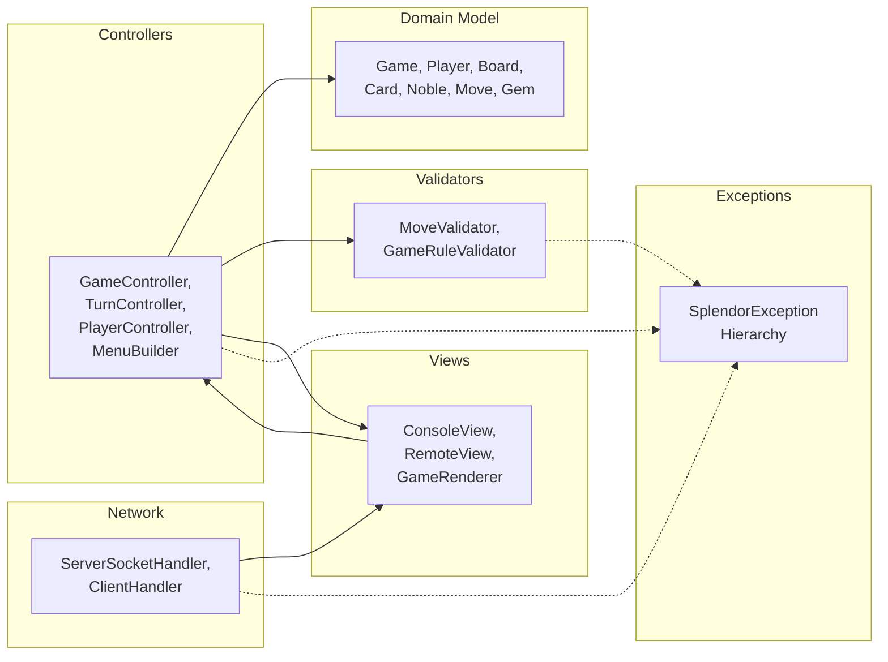
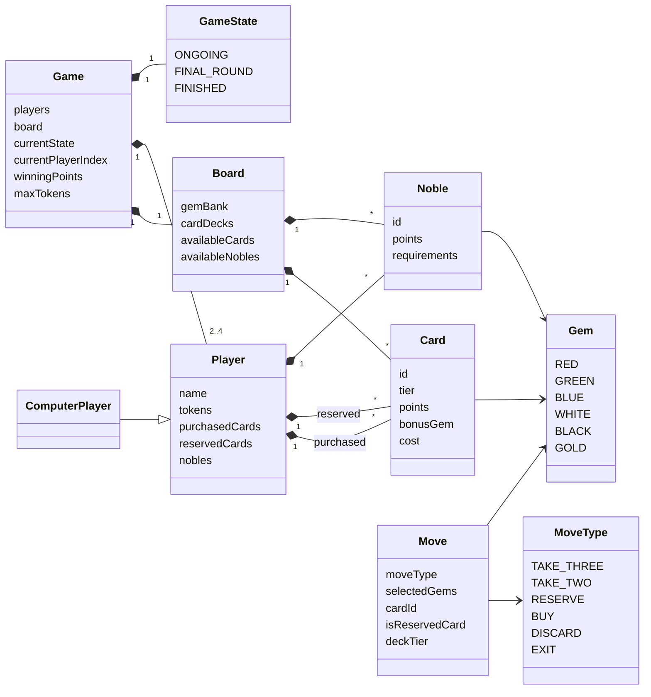
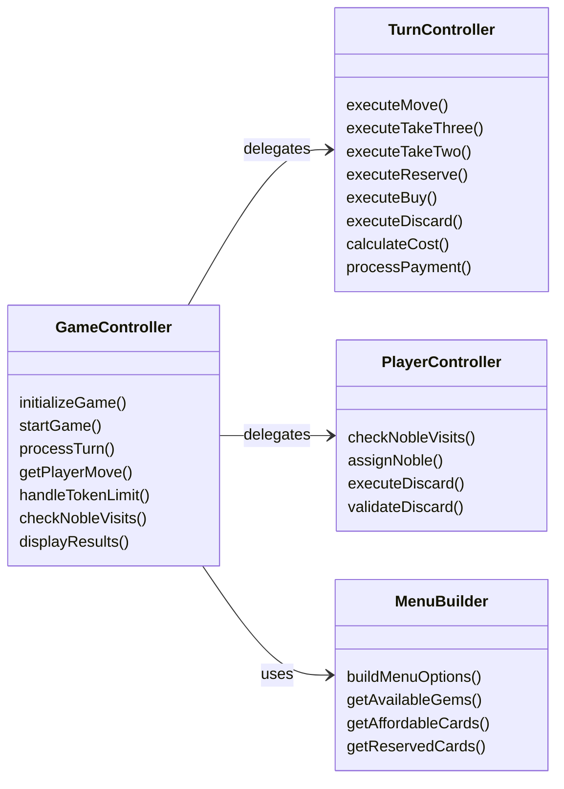
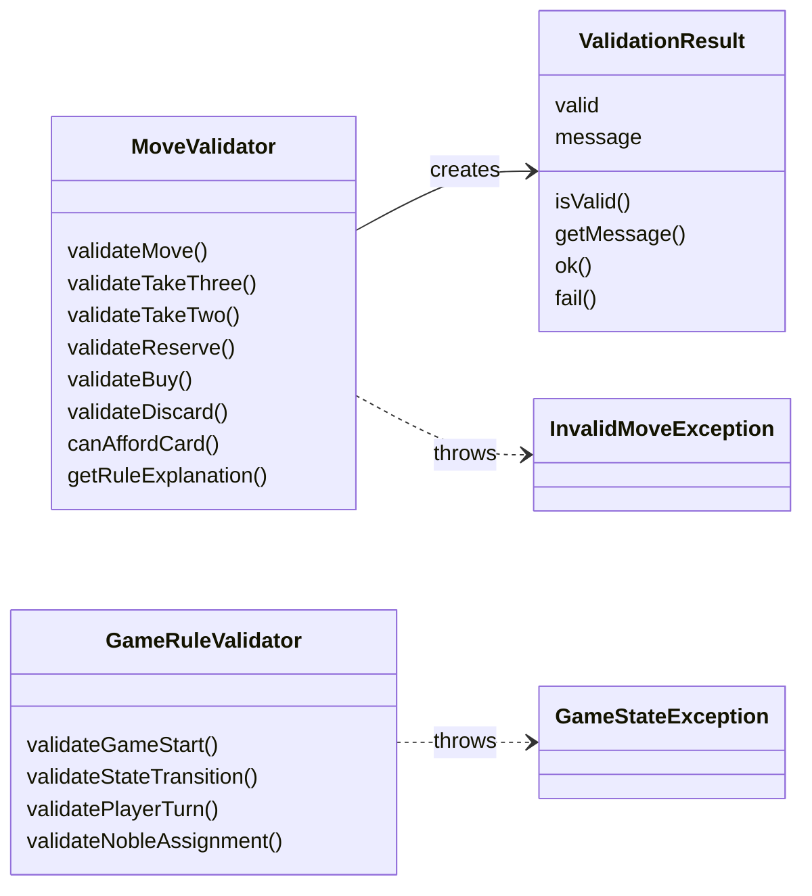
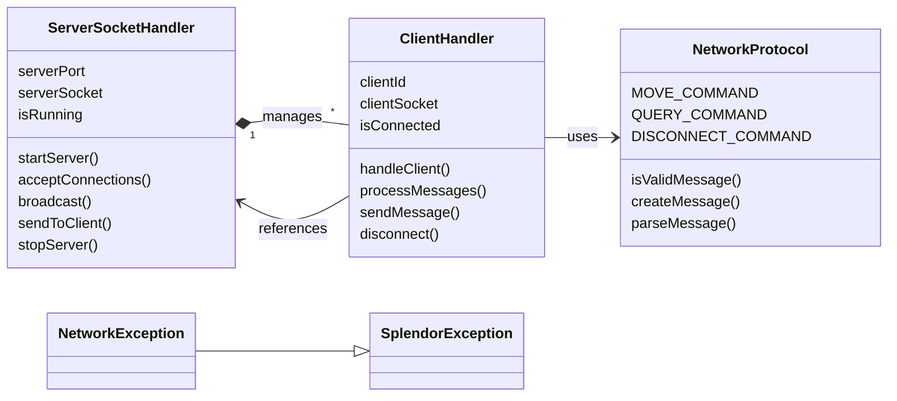
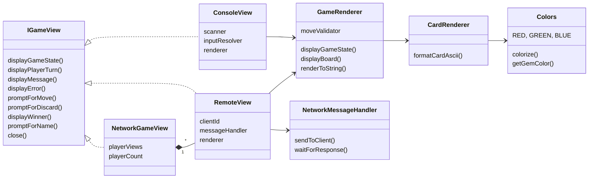
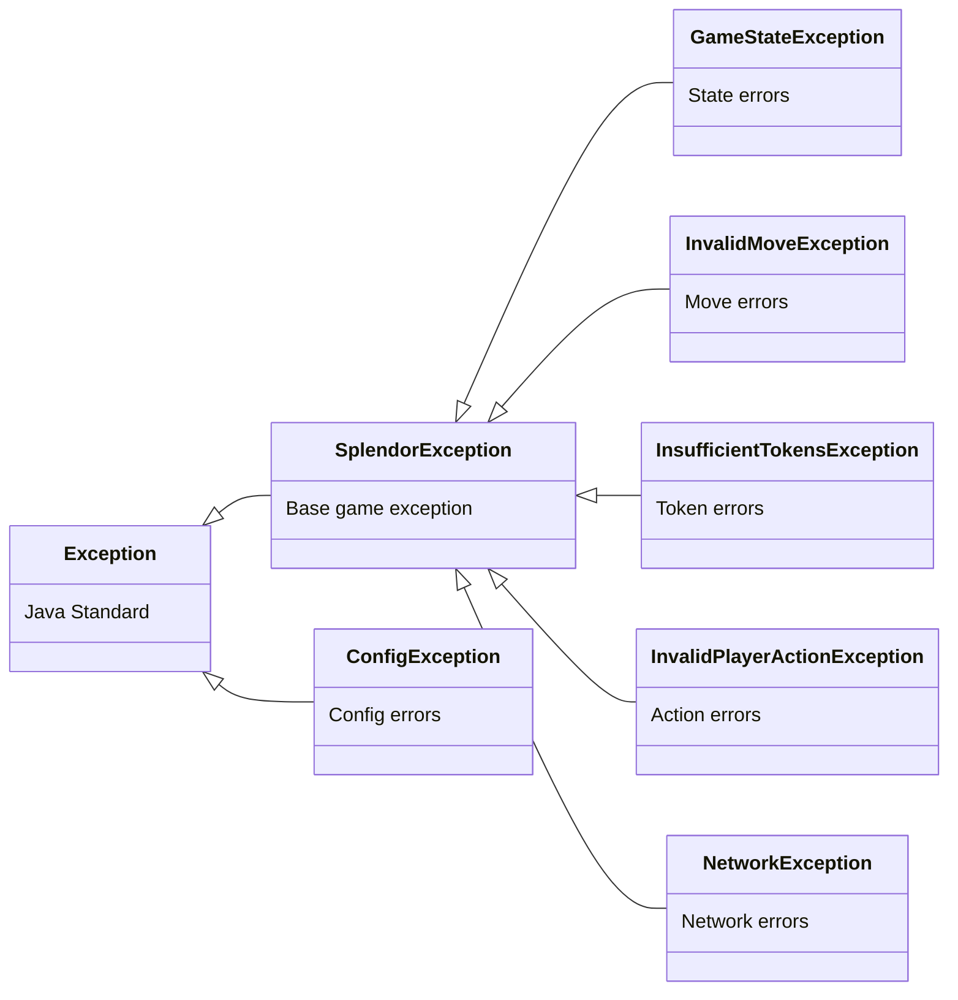

# 🎮 Splendor Java Implementation - Complete Architecture Documentation

---

## Table of Contents
1. [High-Level Architecture](#1-high-level-architecture)
2. [Summary Table](#2-summary-table)
3. [Design Patterns](#3-design-patterns)
4. [Class Count Summary](#4-class-count-summary)
5. [Complete Class List by Package](#5-complete-class-list-by-package)
6. [Six Category Diagrams](#6-six-category-diagrams)
   - 6.1 [Domain (Data Structure)](#61-domain-data-structure)
   - 6.2 [Controllers (Business Logic)](#62-controllers-business-logic)
   - 6.3 [Validators (Rule Checking)](#63-validators-rule-checking)
   - 6.4 [Network (Multiplayer)](#64-network-multiplayer)
   - 6.5 [Views (User Interface)](#65-views-user-interface)
   - 6.6 [Exceptions (Error Handling)](#66-exceptions-error-handling)
7. [How the Game Flows](#7-how-the-game-flows)
   - 7.1 [Startup Flow](#71-startup-flow)
   - 7.2 [Turn Processing Flow](#72-turn-processing-flow)
   - 7.3 [Network Multiplayer Flow](#73-network-multiplayer-flow)
   - 7.4 [Undo Feature Flow](#74-undo-feature-flow)

---

## 1. High-Level Architecture

This project follows a strict **MVC (Model-View-Controller)** architecture:



**Six Main Portions:**
1. **Domain** - Game entities and state
2. **Controllers** - Game flow orchestration
3. **Validators** - Move and rule validation
4. **Network** - Online multiplayer support
5. **Views** - Display and user interaction
6. **Exceptions** - Error handling hierarchy

---

## 2. Summary Table

| Category | Package(s) | Key Classes | Responsibility |
|----------|------------|-------------|---------------|
| **Domain** | `com.splendor.model` | Game, Board, Player, Card, Noble, Move, Gem, BotStrategy | Game entities and state |
| **Controllers** | `com.splendor.controller` | GameController, TurnController, PlayerController, MenuBuilder | Game flow orchestration |
| **Validators** | `com.splendor.model.validator` | MoveValidator, GameRuleValidator, ValidationResult | Rule enforcement |
| **Network** | `com.splendor.network` | ServerSocketHandler, ClientHandler, NetworkProtocol, NetworkException | Online multiplayer |
| **Views** | `com.splendor.view` | ConsoleView, RemoteView, NetworkGameView, GameRenderer, CardRenderer, Colors | Display and input |
| **Exceptions** | `com.splendor.exception` | SplendorException hierarchy (7 classes) | Error handling |
| **Config** | `com.splendor.config` | FileConfigProvider, ConfigKeys, ConfigException | Settings management |
| **Util** | `com.splendor.util` | CardLoader, InputResolver, MoveParser, MoveFormatter, GameLogger, AnsiUtils, GemParser, Constants | Helper utilities |
| **Total** | **51 classes** ||

---

## 3. Design Patterns

| Pattern | Implementation | Classes Involved |
|---------|---------------|------------------|
| **MVC** | Model-View-Controller separation | All packages |
| **Strategy** | AI decision-making | BotStrategy, ComputerPlayer |
| **Factory** | Entity creation | CardLoader creates Card/Noble objects |
| **Template Method** | View interface | IGameView with ConsoleView, RemoteView, NetworkGameView |
| **Observer** | Multiplayer coordination | NetworkGameView manages RemoteViews |
| **Command** | Encapsulate actions | Move class represents player actions |
| **Singleton-like** | Global constants | Constants class with static fields |

---

## 4. Class Count Summary

| Layer | Classes/Interfaces | Count |
|-------|-------------------|-------|
| Domain + Enums | Game, Board, Player, ComputerPlayer, Card, Noble, Move, MenuOption, BotStrategy, Gem, MoveType, MenuAction, GameState | 13 |
| Controllers | GameController, TurnController, PlayerController, MenuBuilder | 4 |
| Validators | MoveValidator, GameRuleValidator, ValidationResult | 3 |
| Network | ServerSocketHandler, ClientHandler, NetworkException | 3 |
| Views | IGameView, ConsoleView, RemoteView, NetworkGameView, GameRenderer, CardRenderer, Colors, NetworkMessageHandler | 8 |
| Exceptions | SplendorException, GameStateException, InvalidMoveException, InsufficientTokensException, InvalidPlayerActionException, NetworkException, ConfigException | 7 |
| Config | IConfigProvider, FileConfigProvider, ConfigKeys, ConfigException | 4 |
| Data | CardDataProvider, CardLoader, CsvCardParser, CustomCardDeckProvider, DataLoadException | 5 |`n| Util | Constants, GameLogger, AnsiUtils, GemParser, InputResolver, MoveFormatter | 6 |
| **Total** | | **53** |

---

## 5. Complete Class List by Package

### 📦 **com.splendor** (Entry Point)
| Class | Description |
|-------|-------------|
| `Main` | Application entry point, parses args, starts console or server mode |

### 📦 **com.splendor.config** (Configuration)
| Class | Type | Description |
|-------|------|-------------|
| `IConfigProvider` | Interface | Configuration reader interface |
| `FileConfigProvider` | Class | Loads settings from `config.properties` file |
| `ConfigKeys` | Class | Constants for config property names |
| `ConfigException` | Exception | Configuration loading errors |

### 📦 **com.splendor.exception** (Error Handling)
| Class | Extends | Description |
|-------|---------|-------------|
| `SplendorException` | `Exception` | Base game exception |
| `GameStateException` | `SplendorException` | Invalid state transitions |
| `InvalidMoveException` | `SplendorException` | Illegal player moves |
| `InsufficientTokensException` | `SplendorException` | Not enough gems |
| `InvalidPlayerActionException` | `SplendorException` | Invalid player actions |

### 📦 **com.splendor.model** (Domain/Data)
| Class | Type | Description |
|-------|------|-------------|
| `Gem` | Enum | Token colors: RED, GREEN, BLUE, WHITE, BLACK, GOLD |
| `MoveType` | Enum | Action types: TAKE_THREE, TAKE_TWO, RESERVE, BUY, DISCARD, EXIT |
| `MenuAction` | Enum | Menu options: TAKE_THREE, TAKE_TWO, RESERVE_VISIBLE, RESERVE_DECK, BUY_VISIBLE, BUY_RESERVED, EXIT_GAME |
| `GameState` | Enum | Game phases: ONGOING, FINAL_ROUND, FINISHED |
| `Card` | Class | Development cards with cost, bonus gem, and prestige points |
| `Noble` | Class | Noble visitors with gem requirements |
| `Player` | Class | Player data: tokens, cards, nobles, points |
| `ComputerPlayer` | Class | Extends Player for AI opponents |
| `Board` | Class | Game board: gem bank, card decks, visible cards, nobles |
| `Game` | Class | Main game session manager |
| `Move` | Class | Represents a player action |
| `MenuOption` | Class | Menu item with availability status |
| `BotStrategy` | Class | AI decision-making logic for computer players |

### 📦 **com.splendor.model.validator** (Validators)
| Class | Description |
|-------|-------------|
| `MoveValidator` | Validates if player moves are legal |
| `GameRuleValidator` | Validates game-level rules (player count, state transitions) |
| `ValidationResult` | Container for validation results (valid/invalid with message) |

### 📦 **com.splendor.controller** (Controllers)
| Class | Description |
|-------|-------------|
| `GameController` | Main orchestrator: manages game lifecycle, turns, coordinates other controllers |
| `TurnController` | Executes specific move types (take gems, reserve card, buy card) |
| `PlayerController` | Handles player-specific logic: noble visits, token discarding |
| `MenuBuilder` | Builds dynamic menu options based on current game state |

### 📦 **com.splendor.network** (Multiplayer)
| Class | Description |
|-------|-------------|
| `ServerSocketHandler` | TCP server: accepts connections, manages clients, broadcasts messages |
| `ClientHandler` | Handles individual client communication in separate thread |
| `NetworkProtocol` | Defines message formats and parsing (MOVE, QUERY, DISCONNECT commands) |
| `NetworkException` | Network-specific errors, extends SplendorException |

### 📦 **com.splendor.util** (Utilities)
| Class | Description |
|-------|-------------|
| `Constants` | Game-wide constants (MIN_PLAYERS, MAX_PLAYERS, etc.) |
| `GameLogger` | Logging utility with timestamps |
| `AnsiUtils` | ANSI color code handling and text formatting |
| `CardLoader` | Loads Card and Noble objects from resources |
| `GemParser` | Parses gem input from players |
| `InputResolver` | User input handling with validation |
| `MoveFormatter` | Formats moves for display and logging |
| `MoveParser` | Parses move commands from network strings |

### 📦 **com.splendor.view** (Views)
| Class | Type | Description |
|-------|------|-------------|
| `IGameView` | Interface | View operations contract (display, prompt, etc.) |
| `ConsoleView` | Class | Local single-player console interface |
| `RemoteView` | Class | View for network-connected clients |
| `NetworkGameView` | Class | Multiplayer coordinator: manages multiple RemoteViews |
| `GameRenderer` | Class | ASCII art game board and state renderer |
| `CardRenderer` | Class | ASCII art card renderer |
| `Colors` | Class | ANSI color code constants |
| `NetworkMessageHandler` | Interface | Network message sending interface |

---

## 6. Six Category Diagrams

### 6.1 Domain (Data Structure)

Core game entities and their relationships:



---

### 6.2 Controllers (Business Logic)

Game flow orchestration:



---

### 6.3 Validators (Rule Checking)

Rule enforcement:



---

### 6.4 Network (Multiplayer)

Online multiplayer infrastructure:



---

### 6.5 Views (User Interface)

Display and interaction:



---

### 6.6 Exceptions (Error Handling)

Exception hierarchy:



---

## 7. How the Game Flows

### 7.1 Startup Flow

```
Main.main()
  ├── Parse command line arguments
  │     └── Check for --server flag
  │
  ├── If Console Mode (no --server):
  │     ├── Create FileConfigProvider
  │     │     └── loadConfiguration() reads config.properties
  │     ├── Create ConsoleView (implements IGameView)
  │     ├── Create GameController(ConsoleView, FileConfigProvider)
  │     │     └── initializeGame()
  │     │           ├── InputResolver.promptForPlayerCount() → 2-4 players
  │     │           ├── Loop: InputResolver.promptForPlayerName() for each player
  │     │           │     └── If name contains "bot", create ComputerPlayer
  │     │           │     └── Else create regular Player
  │     │           ├── new Board(playerCount)
  │     │           │     ├── initializeGemBank() based on player count
  │     │           │     ├── initializeCardDecks() → CardLoader.loadCards(1/2/3)
  │     │           │     ├── initializeAvailableCards() → deal 4 per tier
  │     │           │     └── initializeNobles() → CardLoader.loadNobles()
  │     │           └── GameController.startGame()
  │     └── Game loop begins...
  │
  └── If Server Mode (--server):
        ├── Create FileConfigProvider
        ├── Create ServerSocketHandler(port, FileConfigProvider)
        │     └── startServer()
        │           ├── new ServerSocket(0) → auto-find port
        │           ├── Start acceptor thread: acceptClientConnections()
        │           └── Display IP and port for clients
        └── Wait for clients (telnet/netcat connections)
```

---

### 7.2 Turn Processing Flow

```
GameController.processTurn()
  │
  ├── 1. MenuBuilder.buildMenuOptions(Player, Game)
  │     ├── MoveValidator.validateTakeTwo() for each gem color
  │     ├── Check getAffordableVisibleIds() → which cards player can buy
  │     ├── Check getAffordableReservedIds() → which reserved cards affordable
  │     └── Return List~MenuOption~ with availability flags
  │
  ├── 2. ConsoleView.displayGameState(Game)
  │     ├── GameRenderer.renderToString()
  │     │     ├── renderBoard(Board)
  │     │     ├── renderPlayers(List~Player~)
  │     │     └── renderMenu(List~MenuOption~)
  │     └── System.out.print(rendered output)
  │
  ├── 3. ConsoleView.promptForMove(Player, Game, List~MenuOption~)
  │     ├── Display numbered menu options
  │     ├── InputResolver reads player choice
  │     └── Return Move object
  │
  ├── 4. MoveValidator.validateMove(Move, Player, Game)
  │     ├── If TAKE_THREE: check 3 different gems available
  │     ├── If TAKE_TWO: check 4+ gems of same color in bank
  │     ├── If RESERVE: check player.canReserveCard()
  │     ├── If BUY: check canPlayerAffordCard()
  │     └── If invalid: throw InvalidMoveException → catch and re-prompt
  │
  ├── 5. TurnController.executeMove(Move, Player)
  │     ├── Save undo state: Game.saveUndoState()
  │     │
  │     ├── Case TAKE_THREE_DIFFERENT:
  │     │     ├── Board.removeGems(selectedGems)
  │     │     └── Player.addTokens(selectedGems)
  │     │
  │     ├── Case TAKE_TWO_SAME:
  │     │     ├── Board.removeGems(gem × 2)
  │     │     └── Player.addTokens(gem × 2)
  │     │
  │     ├── Case RESERVE_CARD:
  │     │     ├── If from deck: Board.drawBlindCard(tier)
  │     │     ├── If from board: Board.removeAvailableCard(tier, card)
  │     │     ├── Player.addReservedCard(card)
  │     │     ├── Board.removeGems(GOLD × 1)
  │     │     └── Player.addTokens(GOLD × 1)
  │     │
  │     └── Case BUY_CARD:
  │           ├── Card = findCardToBuy(Move, Player, Board)
  │           ├── Map effectiveCost = calculateEffectiveCost(Player, Card)
  │           ├── processCardPayment(Player, Board, effectiveCost)
  │           ├── Player.addPurchasedCard(card)
  │           └── If from board: Board.removeAvailableCard(tier, card)
  │
  ├── 6. PlayerController.checkNobleVisits(Player)
  │     ├── For each Noble in Board.getAvailableNobles():
  │     │     └── If noble.requirementsMet(player.getGemDiscounts()):
  │     │           ├── Board.removeAvailableNoble(noble)
  │     │           └── Player.addNoble(noble) → +3 points
  │     └── If noble visited: Player keeps turn (no new menu shown)
  │
  ├── 7. PlayerController.handleTokenDiscard(Player)
  │     ├── If Player.getTotalTokenCount() > Game.getMaxTokens():
  │     │     ├── IGameView.promptForTokenDiscard()
  │     │     ├── Player.removeTokens(discardedGems)
  │     │     └── Board.addGems(discardedGems)
  │     └── Else: continue
  │
  ├── 8. Game.hasPlayerReachedWinningScore()
  │     ├── If Player.getTotalPoints() >= winningPoints:
  │     │     └── If not already final round: trigger final round
  │     └── If final round complete: determineWinner()
  │
  └── 9. Game.advanceToNextPlayer()
        └── currentPlayerIndex = (currentPlayerIndex + 1) % playerCount
```

---

### 7.3 Network Multiplayer Flow

#### Server Startup and Initialization

```
Main with --server flag
  └── FileConfigProvider.loadConfiguration()
        └── new ServerSocketHandler(port, configProvider)
              ├── this.serverPort = port (0 = auto-assign)
              ├── this.clientExecutor = Executors.newCachedThreadPool()
              ├── this.connectedClients = new ArrayList<>()
              └── startServer()
                    ├── serverSocket = new ServerSocket(serverPort)
                    ├── this.serverPort = serverSocket.getLocalPort()
                    ├── Print connection info: IP + port
                    └── new Thread(this::acceptClientConnections).start()
```

#### Client Connection Handling

```
ServerSocketHandler.acceptClientConnections()
  └── While isRunning:
        ├── clientSocket = serverSocket.accept()
        ├── clientHandler = new ClientHandler(clientSocket, this, configProvider)
        ├── connectedClients.add(clientHandler)
        └── clientExecutor.submit(() -> clientHandler.handleClient())
              └── ClientHandler.handleClient()
                    ├── clientId = UUID.randomUUID().toString()
                    ├── initializeStreams() → BufferedReader, PrintWriter
                    ├── sendWelcomeMessage() → "Connected to Splendor Server"
                    ├── processClientMessages()
                    └── handleDisconnect()
```

#### Client Message Processing

```
ClientHandler.processClientMessages()
  └── While isConnected:
        ├── message = inputReader.readLine()
        ├── NetworkProtocol.isValidMessage(message) → check format
        ├── String[] parts = NetworkProtocol.parseMessage(message)
        └── Switch on parts[0] (command type):
              │
              ├── Case "MOVE":
              │     ├── String action = parts[1]
              │     ├── String params = parts[2]
              │     ├── Move move = MoveParser.parseMove(action, params)
              │     ├── Server validates move via MoveValidator
              │     ├── If valid: TurnController.executeMove(move, player)
              │     ├── Server updates Game state
              │     ├── ServerSocketHandler.broadcastToAllClients(stateUpdate)
              │     └── Send SUCCESS response to client
              │
              ├── Case "QUERY":
              │     ├── String queryType = parts[1]
              │     ├── Switch queryType:
              │     │     ├── "state": return Game.getGameStateSummary()
              │     │     ├── "players": return player list
              │     │     ├── "board": return board state
              │     │     └── "moves": return recent moves
              │     └── Send STATE response with JSON data
              │
              ├── Case "DISCONNECT":
              │     └── handleDisconnect()
              │
              └── Default:
                    └── sendError("Unknown command")
```

#### Server Broadcasting

```
ServerSocketHandler.broadcastToAllClients(String message)
  └── For each ClientHandler in connectedClients:
        └── clientHandler.sendMessage(message)
              └── outputWriter.println(message)
                    └── Sends to client's telnet/netcat session

ServerSocketHandler.sendToClient(String clientId, String message)
  └── Find ClientHandler by clientId
        └── clientHandler.sendMessage(message)
```

#### Client Command Examples

| Command | Description | Server Response |
|---------|-------------|-----------------|
| `MOVE:TAKE_GEMS:R,G,B` | Take 3 different gems | `SUCCESS:Took Red, Green, Blue` |
| `MOVE:TAKE_GEMS:R,R` | Take 2 same gems | `SUCCESS:Took 2 Red` |
| `MOVE:BUY_CARD:42` | Buy card #42 | `SUCCESS:Bought card 42` |
| `MOVE:RESERVE_CARD:42` | Reserve visible card #42 | `SUCCESS:Reserved card 42` |
| `MOVE:RESERVE_DECK:2` | Reserve from deck tier 2 | `SUCCESS:Reserved from tier 2` |
| `MOVE:DISCARD:R` | Discard 1 red gem | `SUCCESS:Discarded Red` |
| `MOVE:UNDO` | Undo last move | `SUCCESS:Undid last move` |
| `QUERY:state` | Request game state | `STATE:{json data}` |
| `QUERY:players` | Request player list | `STATE:[player list]` |
| `DISCONNECT` | Disconnect from server | `SUCCESS:Goodbye` |

#### Error Handling

```
Server-Side Error Handling
  ├── InvalidMoveException caught → sendError("Invalid move: " + message)
  ├── GameStateException caught → sendError("Invalid state: " + message)
  ├── IOException caught → handleDisconnect()
  └── NetworkException caught → log error, notify admin

ClientHandler.sendError(String errorMessage)
  └── sendMessage("ERROR:" + errorMessage)
        └── Client sees: "ERROR: Invalid move: Not enough gems"
```

---

### 7.4 Undo Feature Flow

```
Player types 'Z' or 'UNDO'
  │
  ├── Game.saveUndoState() [called before each move]
  │     ├── Create GameSnapshot
  │     │     ├── Copy of Board state
  │     │     ├── Copy of all Player states
  │     │     └── Current player index
  │     └── Push to Deque<GameSnapshot> undoHistory
  │     └── Limit: Max 1 undo per turn (clear on next turn)
  │
  └── Game.undo()
        ├── Pop GameSnapshot from undoHistory
        ├── Restore Board state from snapshot
        ├── Restore all Player states from snapshot
        ├── Restore currentPlayerIndex
        └── Broadcast state update to all players (network mode)
```

---

*Splendor Java Implementation - Complete Architecture Documentation*
