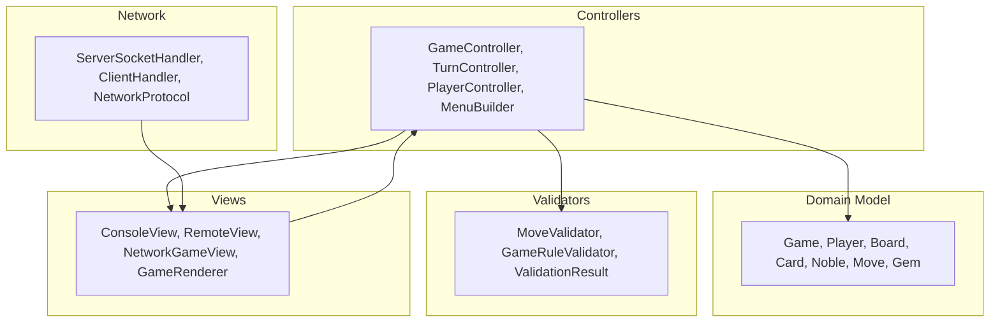
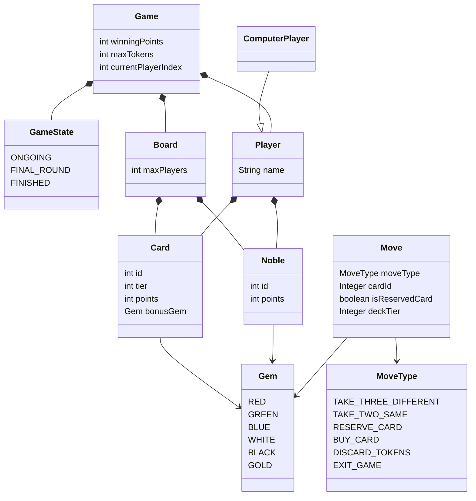
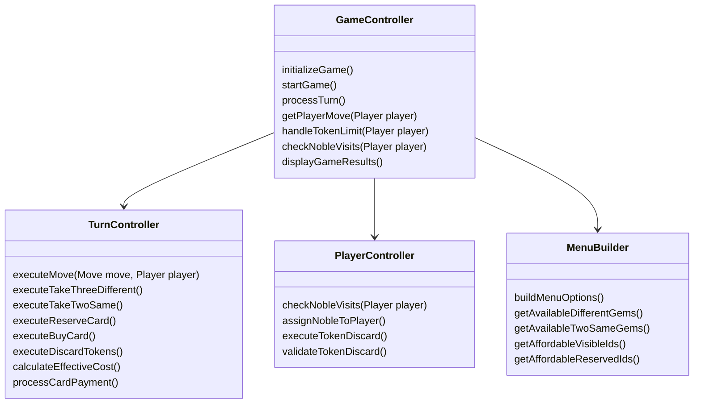
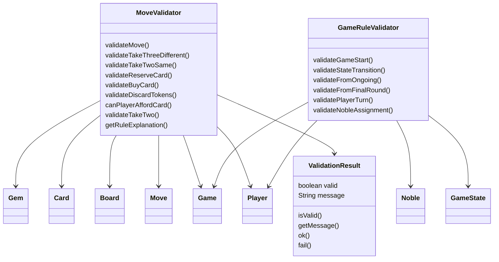
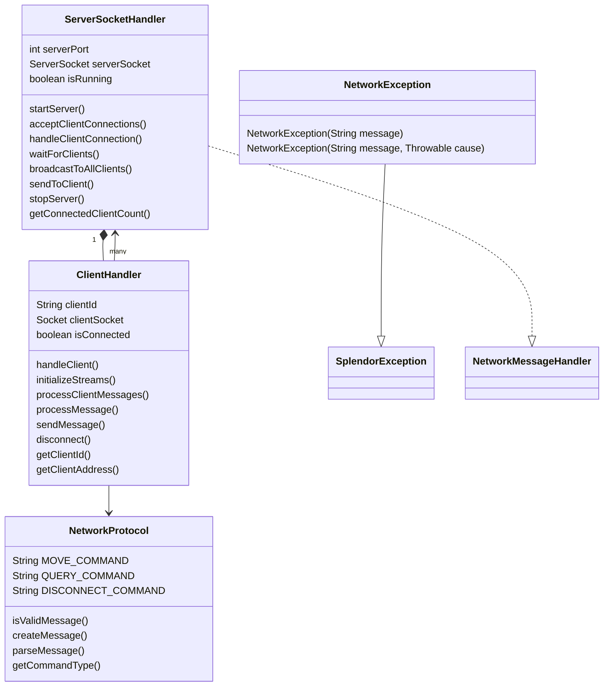
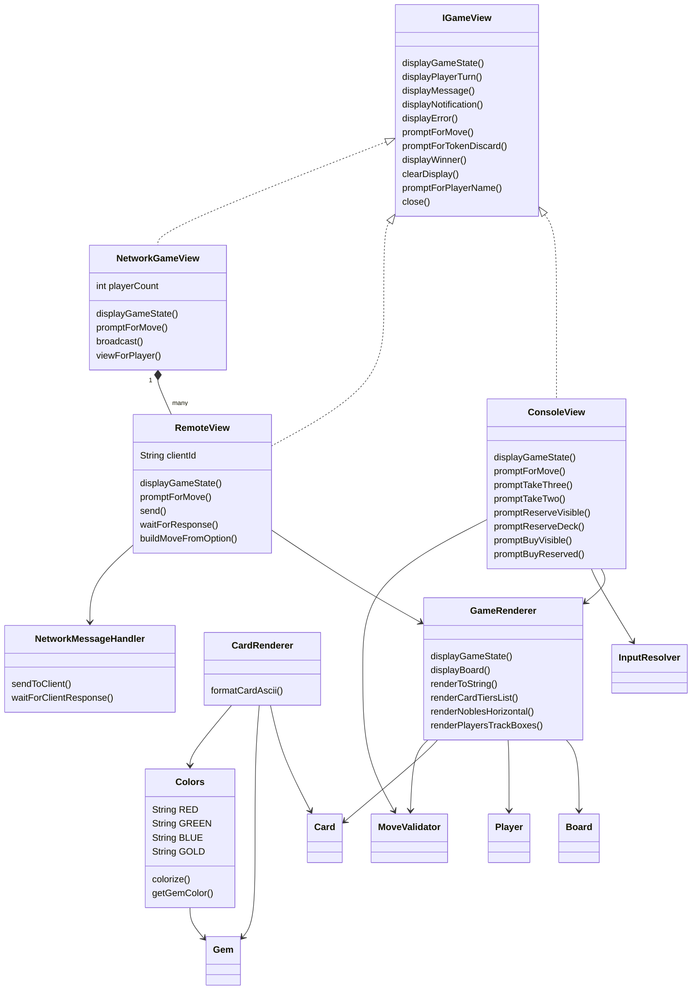

# 🎮 Splendor Java Implementation - Complete Architecture Documentation

---

## 1. High-Level Architecture

This project follows a strict **MVC (Model-View-Controller)** architecture with clear separation of concerns:



**Five Main Portions:**
1. **Domain (Data Structure)** - Game entities and state
2. **Controllers (Business Logic)** - Game flow orchestration
3. **Validators (Rule Checking)** - Move and rule validation
4. **Views (UI)** - Display and user interaction
5. **Network (Multiplayer Infrastructure)** - Online multiplayer support

---

## 2. Complete Class List by Package

### 📦 **com.splendor** (Entry Point)
| Class | Description |
|-------|-------------|
| `Main` | Application entry point, starts console or server mode |

### 📦 **com.splendor.config** (Configuration)
| Class | Type | Description |
|-------|------|-------------|
| `IConfigProvider` | Interface | Configuration reader interface |
| `FileConfigProvider` | Class | Loads settings from properties file |
| `ConfigKeys` | Class | Constants for config property names |
| `ConfigException` | Exception | Configuration loading errors |

### 📦 **com.splendor.exception** (Error Handling)
| Class | Extends | Description |
|-------|---------|-------------|
| `SplendorException` | `Exception` | Base game exception |
| `GameStateException` | `SplendorException` | Invalid state transitions |
| `InvalidMoveException` | `SplendorException` | Illegal player moves |
| `InsufficientTokensException` | `SplendorException` | Not enough gems |
| `InvalidPlayerActionException` | `SplendorException` | Invalid player actions |

### 📦 **com.splendor.model** (Domain/Data)
| Class | Type | Description |
|-------|------|-------------|
| `Gem` | Enum | Token colors (RED, GREEN, BLUE, WHITE, BLACK, GOLD) |
| `MoveType` | Enum | Action types (TAKE_THREE, TAKE_TWO, RESERVE, BUY, etc.) |
| `MenuAction` | Enum | Menu option types |
| `GameState` | Enum | Game phases (ONGOING, FINAL_ROUND, FINISHED) |
| `Card` | Class | Development cards with cost, bonus, and points |
| `Noble` | Class | Noble visitors with requirements |
| `Player` | Class | Player with tokens, cards, and nobles |
| `ComputerPlayer` | Class | Extends Player for AI opponents |
| `Board` | Class | Game board with gem bank and card displays |
| `Game` | Class | Main game session manager |
| `Move` | Class | Represents a player action |
| `MenuOption` | Class | Menu item with availability status |
| `BotStrategy` | Class | AI decision-making logic |

### 📦 **com.splendor.model.validator** (Rule Validation)
| Class | Description |
|-------|-------------|
| `MoveValidator` | Validates if moves are legal |
| `GameRuleValidator` | Validates game-level rules |
| `ValidationResult` | Container for validation results |

### 📦 **com.splendor.controller** (Business Logic)
| Class | Description |
|-------|-------------|
| `GameController` | Main orchestrator for game flow |
| `TurnController` | Executes player moves |
| `PlayerController` | Handles noble visits and token discarding |
| `MenuBuilder` | Builds dynamic menu options |

### 📦 **com.splendor.network** (Multiplayer)
| Class | Description |
|-------|-------------|
| `ServerSocketHandler` | TCP server accepting client connections |
| `ClientHandler` | Handles individual client communication |
| `NetworkProtocol` | Message protocol definitions |
| `NetworkException` | Network-specific errors |

### 📦 **com.splendor.util** (Utilities)
| Class | Description |
|-------|-------------|
| `Constants` | Game-wide constants |
| `GameLogger` | Logging utility |
| `AnsiUtils` | ANSI color code handling |
| `CardLoader` | Loads cards from resources |
| `GemParser` | Parses gem input |
| `InputResolver` | User input handling |
| `MoveFormatter` | Formats moves for display |
| `MoveParser` | Parses move commands |

### 📦 **com.splendor.view** (User Interface)
| Class | Type | Description |
|-------|------|-------------|
| `IGameView` | Interface | View operations contract |
| `ConsoleView` | Class | Local console UI |
| `RemoteView` | Class | Network client view |
| `NetworkGameView` | Class | Multiplayer view coordinator |
| `GameRenderer` | Class | ASCII game state renderer |
| `CardRenderer` | Class | ASCII card renderer |
| `Colors` | Class | Color code constants |
| `NetworkMessageHandler` | Interface | Network message interface |

---

## 3. Five Category Diagrams

### 3.1 Domain (Data Structure) - Model Layer

The core game entities and their relationships:



**Key Concepts:**
- **Game** is the root containing Board and 2-4 Players
- **Board** manages the gem bank, card decks, and available nobles
- **Player** owns tokens, purchased cards, reserved cards, and attracted nobles
- **Card** and **Noble** are placed on the Board and collected by Players
- **Move** represents actions players can take

---

### 3.2 Controllers (Business Logic)

Orchestrates game flow and coordinates actions:



**Responsibilities:**
- **GameController**: Main orchestrator - manages game lifecycle, turns, and coordinates other controllers
- **TurnController**: Executes specific move types (take gems, reserve card, buy card)
- **PlayerController**: Handles player-specific logic (noble visits, token discarding)
- **MenuBuilder**: Dynamically builds available menu options based on game state

---

### 3.3 Validators (Rule Checking)

Ensures all moves and game transitions follow the rules:



**Validation Rules:**
- **MoveValidator**: Checks if specific moves are legal (can afford card? enough gems in bank? valid gem selection?)
- **GameRuleValidator**: Validates game-level rules (valid player count, state transitions, noble assignments)
- **ValidationResult**: Returns validation status with human-readable messages

---

### 3.4 Network (Multiplayer Infrastructure)

Enables online multiplayer gameplay:



**Network Flow:**
1. **ServerSocketHandler** starts and listens for connections
2. **ClientHandler** manages each connected client in a separate thread
3. **NetworkProtocol** defines message formats (MOVE:BUY_CARD:42, QUERY:state, etc.)
4. **NetworkException** handles network-specific errors

---

### 3.5 Views (User Interface)

Handles all display and user interaction:



**View Types:**
- **ConsoleView**: Local single-player console interface
- **RemoteView**: View for a network-connected client
- **NetworkGameView**: Manages multiple RemoteViews for multiplayer
- **GameRenderer**: Renders ASCII art game board and state
- **CardRenderer**: Renders individual cards as ASCII art
- **Colors**: Provides ANSI color codes

---

## 4. How the Game Flows

### **Startup Flow**

```
Main.java
  └── FileConfigProvider (load config.properties)
       └── GameController.initializeGame()
            ├── Create Players (2-4)
            ├── Create Board (load cards/nobles)
            └── GameController.startGame()
```

### **Turn Processing Flow**

```
GameController.processTurn()
  ├── MenuBuilder.buildMenuOptions()      // What can player do?
  ├── IGameView.promptForMove()           // Get player choice
  ├── MoveValidator.validateMove()        // Is it legal?
  ├── TurnController.executeMove()        // Execute the action
  ├── PlayerController.checkNobleVisits() // Did noble visit?
  ├── PlayerController.handleTokenDiscard() // Too many tokens?
  └── GameFlowController.updateState()    // Check for winner
```

### **Network Multiplayer Flow**

```
ServerSocketHandler (accepts connections)
  ├── Creates ClientHandler per client
  ├── ClientHandler.processMessage()
  │     └── Parses MOVE commands
  ├── ServerSocketHandler broadcasts updates
  └── NetworkGameView coordinates all RemoteViews
```

---

## 5. Summary Table

| Category | Package(s) | Key Classes | Responsibility |
|----------|------------|-------------|---------------|
| **Domain** | `model` | Game, Board, Player, Card, Noble, Move, Gem, BotStrategy | Game entities and state |
| **Controllers** | `controller` | GameController, TurnController, PlayerController, MenuBuilder | Game flow orchestration |
| **Validators** | `model.validator` | MoveValidator, GameRuleValidator, ValidationResult | Rule enforcement |
| **Views** | `view` | ConsoleView, RemoteView, NetworkGameView, GameRenderer, CardRenderer | Display and input |
| **Network** | `network` | ServerSocketHandler, ClientHandler, NetworkProtocol | Online multiplayer |
| **Config** | `config` | FileConfigProvider, ConfigKeys | Settings management |
| **Exception** | `exception` | SplendorException hierarchy | Error handling |
| **Util** | `util` | CardLoader, InputResolver, MoveParser, GameLogger | Helper utilities |

---

## 6. Design Patterns Used

| Pattern | Where Used |
|---------|------------|
| **MVC** | Separation of Model, View, Controller |
| **Strategy** | BotStrategy for AI decision-making |
| **Factory** | CardLoader creates Card/Noble objects |
| **Template Method** | IGameView interface with multiple implementations |
| **Observer** | NetworkGameView coordinates multiple RemoteViews |
| **Command** | Move objects encapsulate player actions |
| **Singleton-like** | Constants class with static fields |

---

## 7. Class Count Summary

| Category | Classes/Interfaces |
|----------|-------------------|
| Domain | 12 (Game, Board, Player, ComputerPlayer, Card, Noble, Move, MenuOption, BotStrategy + 4 enums) |
| Controllers | 4 (GameController, TurnController, PlayerController, MenuBuilder) |
| Validators | 3 (MoveValidator, GameRuleValidator, ValidationResult) |
| Network | 4 (ServerSocketHandler, ClientHandler, NetworkProtocol, NetworkException) |
| Views | 8 (IGameView, ConsoleView, RemoteView, NetworkGameView, GameRenderer, CardRenderer, Colors, NetworkMessageHandler) |
| **Total Core** | **31 classes** |
| Supporting | 14 (config, exception, util, Main) |
| **Grand Total** | **~45 classes** |

---

*Generated for educational purposes - Splendor Java Implementation*
