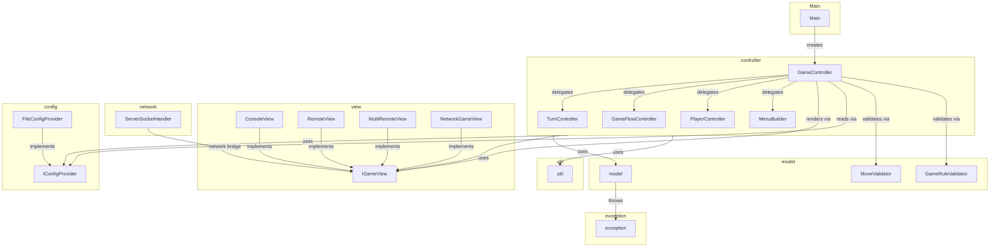
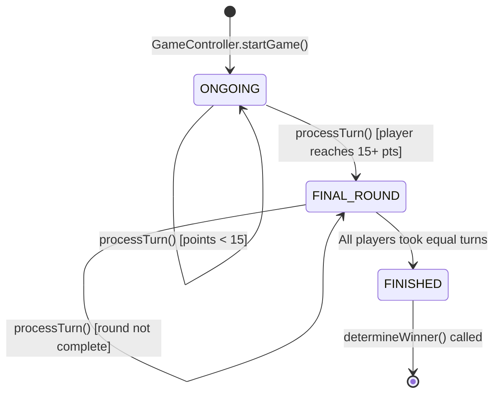
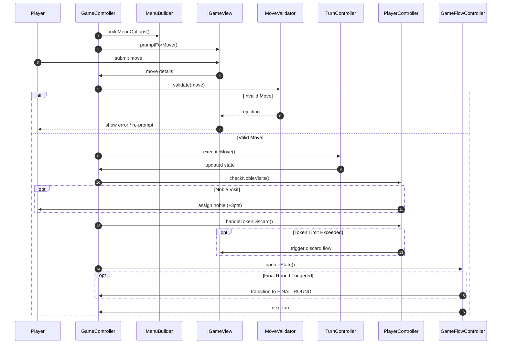
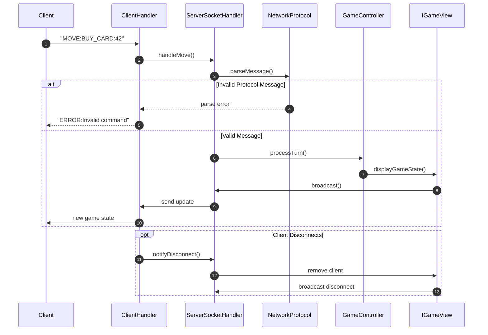
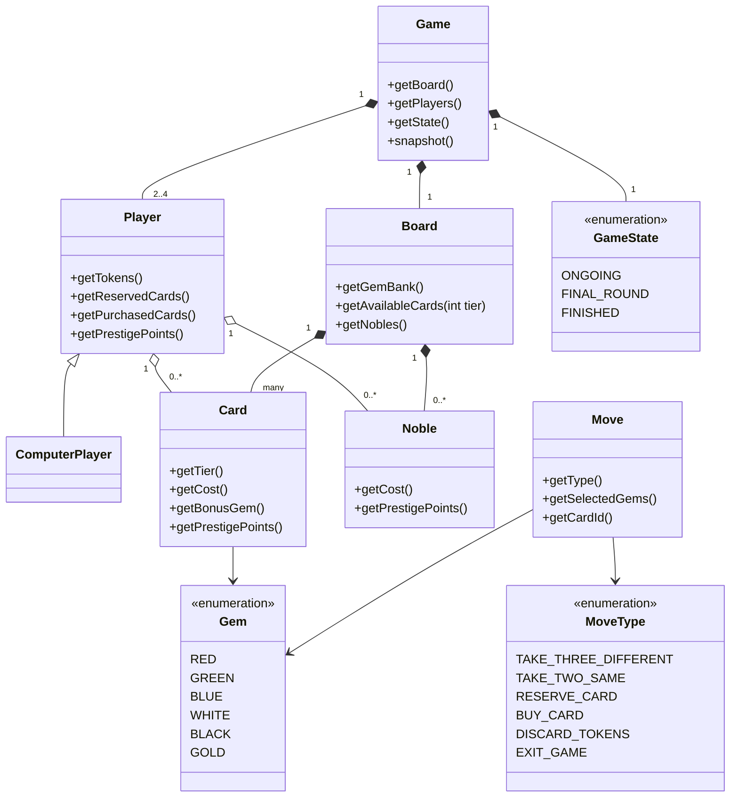
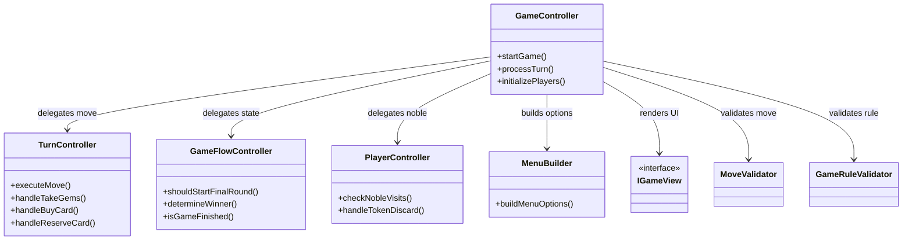
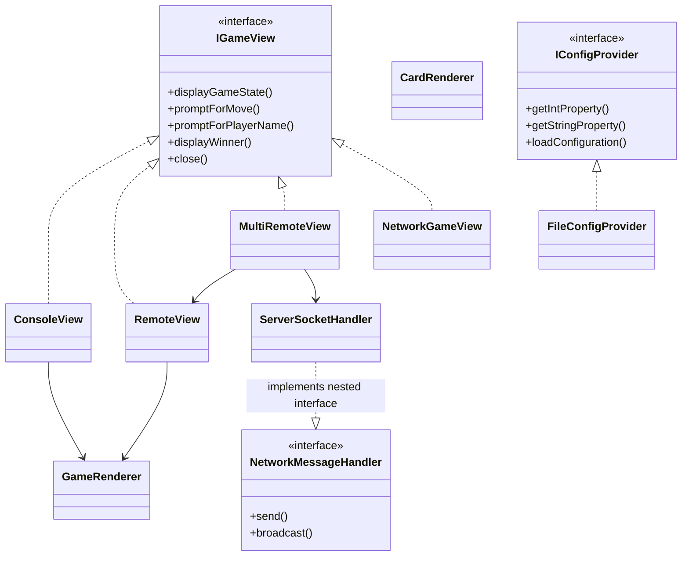
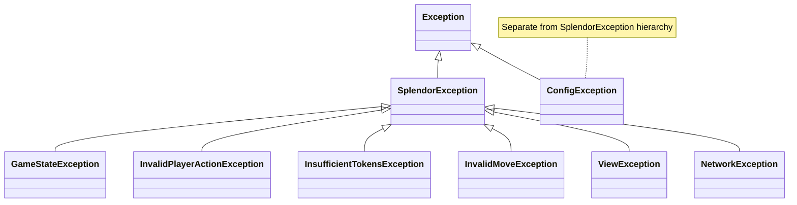

# Splendor (Java Implementation)

A modular, strictly MVC-based implementation of the board game Splendor in Java.

## Table of Contents
- [Features](#features)
- [Architecture Overview](#architecture-overview)
- [Gameplay Flow](#gameplay-flow)
- [How to Play](#how-to-play)
- [Getting Started](#getting-started)
- [Network Multiplayer](#network-multiplayer)
- [Configuration](#configuration)
- [Testing](#testing)
- [Project Structure](#project-structure)
- [Contributing](#contributing)
- [AI Attribution](#ai-attribution)
- [License](#license)

## Features
- **MVC Architecture**: Separation of concerns between Model, View, and Controller.
- **Custom Exception Handling**: Robust error management using the `SplendorException` hierarchy.
- **Configurable**: Game rules and setup parameters loaded from `src/resources/config.properties`.
- **Console Interface**:
  - **ASCII Dashboard**: Cards and game state are rendered in a clean, frame-based dashboard.
  - **Color Support**: Gems and player info are color-coded (Red, Green, Blue, White, Black, Gold).
  - **Smart Menus**: Options are dynamically enabled or disabled based on game state.
  - **Interactive Prompts**: Intuitive sub-menus for selecting gems and cards.
  - **Undo Feature**: Allows players to undo their last turn by typing `Z` or `UNDO`.
- **Network Support**: Multiplayer capabilities via TCP sockets.
- **Bot/CPU Players**: Name a player with "bot" in the name to enable computer-controlled opponents.

## Architecture Overview

The project follows a strict MVC pattern to ensure separation of concerns. The Controller layer orchestrates the game logic by delegating specific tasks to specialized sub-controllers and validators.



<details>
<summary>🎲 Game State Lifecycle — ONGOING → FINAL_ROUND → FINISHED</summary>



</details>

## Gameplay Flow

The following sequence diagram illustrates the standard turn lifecycle, including validation and special post-turn checks for noble visits or token limits.



## How to Play

### Objective
The goal is to be the first player to reach **15 prestige points** (configurable). Points are earned by purchasing development cards and attracting nobles.

### Setup
The game scales based on the number of players (2-4):
- 2 Players: 4 gems each color, 3 nobles
- 3 Players: 5 gems each color, 4 nobles
- 4 Players: 7 gems each color, 5 nobles
- Gold Tokens: Always 5

### Actions (one per turn)
1. **Take 3 Different Gems**: Pick 1 gem each of 3 different colors (no Gold).
2. **Take 2 Same Gems**: Take 2 gems of the same color (only if 4+ available in bank).
3. **Reserve a Card**: Reserve a visible card or draw from a deck. Receive 1 Gold token. Max 3 reserved.
4. **Buy a Development Card**: Pay the gem cost (discounted by your purchased card bonuses). Gold tokens are wildcards.
5. **Buy a Reserved Card**: Purchase a previously reserved card from your hand.

### Nobles
At end of turn, if your gem bonuses (from purchased cards) meet a Noble's requirements, that Noble visits automatically (3 prestige points). Only 1 noble per turn.

### Winning
Game ends when a player reaches 15+ points. The current round finishes so all players get equal turns. Highest score wins. Tie-breaker: fewest purchased cards.

### Token Limit
Max 10 tokens (including Gold). Must discard down to 10 at end of turn.

### Undo
After your move executes, type `Z` or `UNDO` to revert your turn and try again.

### Bot Players
Include "bot" in a player's name (e.g., "Bot1", "AngryBot") to make them a computer-controlled player. Bots use a greedy strategy.

## Getting Started

### Prerequisites
- **Java JDK 17** or higher
- A terminal with ANSI color support (most modern terminals)
- No build tools required, uses `javac` directly

### Building

**Windows:**
```batch
compile.bat
```

**Linux / macOS:**
```bash
chmod +x compile.sh
./compile.sh
```

### Running the Game

**Windows:**
```batch
run.bat
```

**Linux / macOS:**
```bash
chmod +x run.sh
./run.sh
```

## Network Multiplayer

Multiplayer is supported via a custom TCP protocol. The server manages the game state and broadcasts updates to all connected clients.

<details>
<summary>🌐 Network Flow — Client command to game response</summary>



</details>

### 1. Start the Server
```bash
java -cp classes com.splendor.Main --server
```
The server auto-discovers a free port and displays connection addresses.

### 2. Connect as Client
**Netcat (WSL/Linux/macOS):**
```bash
nc <host-ip> <port>
```
**Telnet:**
```bash
telnet <host-ip> <port>
```

### 3. Network Commands
- `MOVE:TAKE_GEMS:R,G,B`: Take 3 different gems
- `MOVE:TAKE_GEMS:R,R`: Take 2 same gems
- `MOVE:BUY_CARD:<id>`: Buy a card
- `MOVE:RESERVE_CARD:<id>`: Reserve a card
- `MOVE:DISCARD_GEMS:R`: Discard token
- `MOVE:UNDO` or `Z`: Undo turn
- `QUERY:state`: Query game state
- `DISCONNECT`: Leave game

## Configuration

Game settings in `src/resources/config.properties`:
| Setting | Default | Description |
|---------|---------|-------------|
| `game.points.win` | 15 | Points needed to trigger final round |
| `game.max_tokens` | 10 | Maximum tokens a player can hold |
| Player scaling | varies | Token/noble counts per player count |

## Testing

### Running Tests

**Windows:**
```batch
run_tests.bat
```

**Linux / macOS:**
```bash
chmod +x run_tests.sh
./run_tests.sh
```

### Test Coverage
The test suite uses **JUnit 5** and covers:
- **Game Flow**: Turn advancement, final round triggers, winner determination.
- **Move Validation**: Gem taking rules, card affordability, reserve limits.
- **Controller Logic**: Game initialization, move execution, noble visits.
- **Network Integration**: Server-client communication, message routing.

Test files are in the `test/` directory mirroring the `src/` package structure.

## Project Structure

The project directory structure is organized into logical packages following the MVC pattern.

```
src/com/splendor/
├── Main.java             # Entry point (console or --server mode)
├── config/               # Configuration (IConfigProvider, FileConfigProvider)
├── controller/           # Game orchestration (GameController, TurnController, PlayerController, MenuBuilder)
├── exception/            # Custom exceptions (SplendorException hierarchy)
├── model/                # Core entities (Game, Player, Board, Card, Gem, Noble, BotStrategy)
│   └── validator/        # Move & rule validation
├── network/              # Multiplayer (ServerSocketHandler, ClientHandler, NetworkProtocol)
├── util/                 # Utilities (InputResolver, CardLoader, GameLogger, GemParser, MoveParser, MoveFormatter, AnsiUtils)
└── view/                 # UI (ConsoleView, RemoteView, GameRenderer, CardRenderer, IGameView)
```

<details>
<summary>📦 Model Domain — Game, Player, Board, Card, Noble, Move + enums</summary>



</details>

<details>
<summary>🎮 Controller Layer — GameController orchestration chain</summary>



</details>

<details>
<summary>👁️ View & Config Interfaces — IGameView implementations and IConfigProvider</summary>



</details>

<details>
<summary>⚠️ Exception Hierarchy — SplendorException and domain subclasses</summary>



</details>

## Contributing

### Getting Started
1. Fork the repository
2. Create a feature branch (`git checkout -b feature/my-feature`)
3. Make your changes
4. Run the test suite (`run_tests.bat` or `run_tests.sh`), all tests must pass
5. Submit a Pull Request

### Code Conventions
- **Architecture**: Strict MVC. Model has no I/O, View is interface-based, Controller orchestrates.
- **Exception Handling**: Use the custom `SplendorException` hierarchy, never expose raw stack traces.
- **Input Safety**: All user input wrapped in try-catch via `InputResolver`.
- **AI Transparency**: Document any AI-assisted code in comments.
- **Documentation**: When adding new core logic, update relevant Mermaid diagrams in `README.md`.

### CI/CD
The repository uses GitHub Actions for:
- **Security Scanning**: TruffleHog scans for leaked secrets on push/PR.
- **PR Labeling**: Automatic labels based on changed files.
- **Contributor Greeting**: Welcome messages for first-time contributors.

### Reporting Issues
Open a GitHub Issue with:
- Steps to reproduce
- Expected vs actual behavior
- Java version and OS

## AI Attribution
This project was developed with the assistance of AI tools.
- **Code Generation**: Core architectural components and boilerplate.
- **Logic Refinement**: Game rules and edge cases via iterative prompting.
- **Documentation**: README and RULES drafted by AI.
- **Review**: All generated code reviewed and modified by humans.

## License
This project is for educational purposes.
