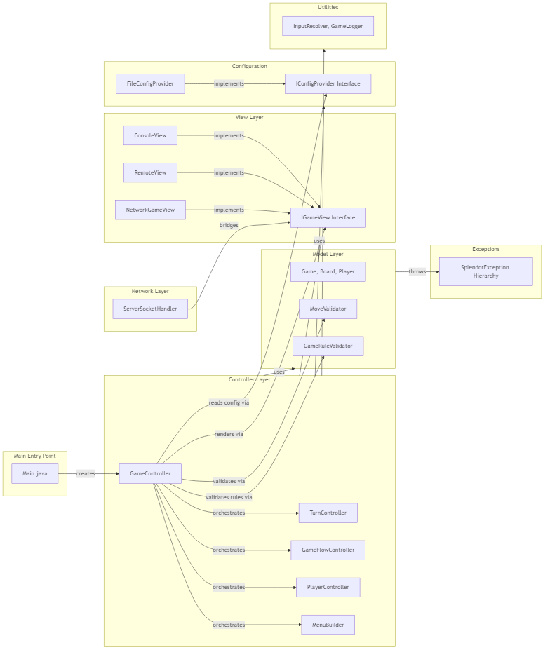
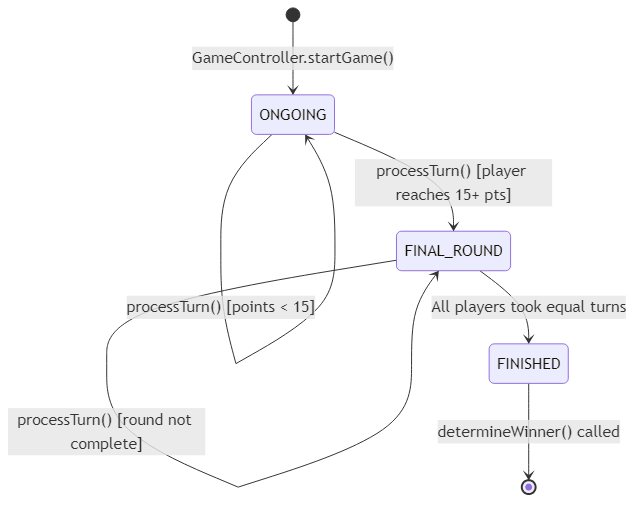
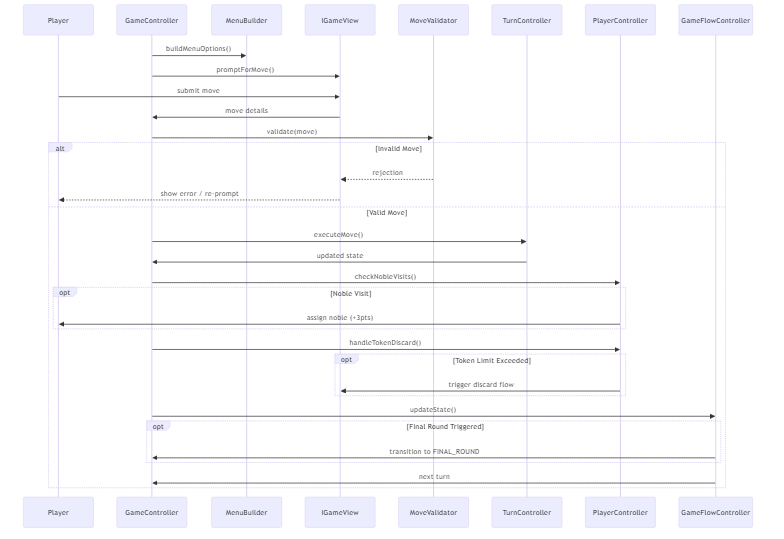

# Splendor (Java Implementation)


A modular, strictly MVC-based implementation of the board game Splendor in Java.

## Quick Start

```bash
# Build the project
./compile.sh    # Unix/macOS
.\compile.bat   # Windows

# Run the game (console mode)
./run.sh        # Unix/macOS
.\run.bat       # Windows

# Run in server mode (network multiplayer)
java -cp classes com.splendor.Main --server
```

## Table of Contents
- [Features](#features)
- [Quick Start](#quick-start)
- [Architecture Overview](#architecture-overview)
- [Gameplay Flow](#gameplay-flow)
- [How to Play](#how-to-play)
- [Getting Started](#getting-started)
- [Network Multiplayer](#network-multiplayer)
- [Configuration](#configuration)
- [Testing](#testing)
- [Project Structure](#project-structure)
- [Contributing](#contributing)
- [AI Attribution](#ai-attribution)
- [License](#license)

## Features

- **MVC Architecture**: Strict separation of concerns between Model, View, and Controller.
- **Custom Exception Handling**: Robust error management using the `SplendorException` hierarchy.
- **Configurable**: Game rules and setup parameters loaded from `src/resources/config.properties`.
- **Console Interface**:
  - **ASCII Dashboard**: Cards and game state are rendered in a clean, frame-based dashboard.
  - **Color Support**: Gems and player info are color-coded (Red, Green, Blue, White, Black, Gold).
  - **Smart Menus**: Options are dynamically enabled or disabled based on game state.
  - **Interactive Prompts**: Intuitive sub-menus for selecting gems and cards.
  - **Undo Feature**: Allows players to undo their last turn by typing `Z` or `UNDO`.
- **Network Support**: Multiplayer capabilities via TCP sockets.
- **Bot/CPU Players**: Name a player with "bot" in the name to enable computer-controlled opponents.
- **Automated Documentation**: Javadoc generation with pre-commit validation.

## Architecture Overview

The project follows a strict MVC pattern to ensure separation of concerns. The Controller layer orchestrates the game logic by delegating specific tasks to specialized sub-controllers and validators.



<details>
<summary>📋 View Architecture Diagram Source (.mmd)</summary>

[`docs/diagrams/README_diagram_1.mmd`](./docs/diagrams/README_diagram_1.mmd)

</details>



<details>
<summary>📋 View State Diagram Source (.mmd)</summary>

[`docs/diagrams/README_diagram_2.mmd`](./docs/diagrams/README_diagram_2.mmd)

</details>

## Gameplay Flow

The following sequence diagram illustrates the standard turn lifecycle, including validation and special post-turn checks for noble visits or token limits.



<details>
<summary>📋 View Sequence Diagram Source (.mmd)</summary>

[`docs/diagrams/README_diagram_3.mmd`](./docs/diagrams/README_diagram_3.mmd)

</details>

## How to Play

### Objective

The goal is to be the first player to reach 15 prestige points (configurable). Points are earned by purchasing development cards and attracting noble tiles.

### Setup

The game scales based on the number of players (2-4):

| Players | Gem Tokens per Color | Nobles Available |
|---------|---------------------|------------------|
| 2       | 4                   | 3                |
| 3       | 5                   | 4                |
| 4       | 7                   | 5                |

### Actions (one per turn)

1. **Take 3 Different Gems**: Pick 1 gem each of 3 different colors (no Gold).
2. **Take 2 Same Gems**: Pick 2 gems of the same color (only if ≥4 available).
3. **Reserve a Card**: Take a face-up card or draw from a deck (max 3 reserved).
4. **Buy a Card**: Purchase a face-up card using your gems and discounts.
5. **Buy Reserved Card**: Purchase a card you previously reserved.

### Nobles

At end of turn, if your gem bonuses (from purchased cards) meet a Noble's requirements, that Noble visits you automatically (+3 points).

### Winning

Game ends when a player reaches 15+ points. The current round finishes so all players get equal turns. Tiebreaker: fewest purchased cards.

### Token Limit

Max 10 tokens (including Gold). Must discard down to 10 at end of turn.

### Undo

After your move executes, type `Z` or `UNDO` to revert your turn and try again.

### Bot Players

Include "bot" in a player's name (e.g., "Bot1", "AngryBot") to make them a computer-controlled opponent.

## Getting Started

### Prerequisites

- Java JDK 17 or higher
- Maven (optional, for dependency management)

### Building

**Windows:**
```batch
.\compile.bat
```

**Unix/macOS:**
```bash
./compile.sh
```

### Running the Game

**Console Mode (Single Player or Local Multiplayer):**

Windows:
```batch
.\run.bat
```

Unix/macOS:
```bash
./run.sh
```

**Server Mode (Network Multiplayer):**

```bash
java -cp classes com.splendor.Main --server
```

## Network Multiplayer

Multiplayer is supported via a custom TCP protocol. The server manages the game state and broadcasts updates to all connected clients.

### 1. Start the Server

The server auto-discovers a free port and displays connection addresses.

```bash
java -cp classes com.splendor.Main --server
```

### 2. Connect as Client

**Netcat (WSL/Linux/macOS):**
```bash
nc <server-ip> <port>
```

**PowerShell (Windows):**
```powershell
powershell -Command "(New-Object System.Net.Sockets.TcpClient).Connect('<server-ip>', <port>)"
```

### 3. Network Input Style (Current)

The current server/client flow is **prompt-driven**. Connected clients submit plain responses to prompts (menu choice numbers, gem codes, card IDs, tier IDs, discard inputs), rather than sending fixed `MOVE:...` command frames.

Common remote inputs:
- `1`, `2`, `3`, etc. for menu selections.
- Gem selections like `R G B` (or `AU` for gold where allowed by prompt).
- Numeric card IDs / tier IDs when prompted.
- `Z` or `UNDO` to return to the previous prompt/menu.
- `DISCARD:R B` (legacy accepted) or pair format like `R 1 B 1` during discard prompts.

Low-level protocol utilities still validate message prefixes such as `MOVE:`, `QUERY:`, and `DISCONNECT`, but gameplay input in this implementation is consumed as prompt responses by the remote view/client handler flow.

## Configuration

Game settings in `src/resources/config.properties`:

| Setting | Default | Description |
|---------|---------|-------------|
| `game.points.win` | 15 | Points required to win |
| `game.tokens.max` | 10 | Maximum tokens per player |
| `game.tokens.2p` | 4 | Gem tokens per color (2 players) |
| `game.tokens.3p` | 5 | Gem tokens per color (3 players) |
| `game.tokens.4p` | 7 | Gem tokens per color (4 players) |
| `game.nobles.base` | 3 | Base number of nobles |
| `game.nobles.add` | 1 | Additional nobles per player |
| `game.reserved.max` | 3 | Maximum reserved cards |

## Testing

### Running Tests

Prerequisites:
- Java 17+ installed
- JUnit console JAR present at `lib/junit-platform-console-standalone-1.10.2.jar`

**Windows:**
```batch
test\run_tests.bat
```

**Unix/macOS:**
```bash
bash test/run_tests.sh
```

Run a specific class:
```bash
bash test/run_tests.sh --class com.splendor.controller.GameLogicTest
```

Run by package/category:
```bash
bash test/run_tests.sh --category com.splendor.model
```

### Test Coverage

The test suite uses JUnit 5 and covers:

- **Model Layer**: Game state, player actions, card mechanics
- **Validators**: Move validation, rule enforcement
- **Controllers**: Turn logic, game flow
- **Edge Cases**: Invalid inputs, boundary conditions

### Where the test code lives

- `test/com/splendor/controller/` — controller/game flow behavior tests
- `test/com/splendor/model/` — model/game state and strategy tests
- `test/com/splendor/model/validator/` — move/rule validation tests
- `test/com/splendor/network/` — network integration tests
- `test/com/splendor/test/` — documentation/config helper tests

### Script parity (.sh and .bat)

Windows `.bat` counterparts exist for the main shell scripts:
- `compile.sh` ↔ `compile.bat`
- `run.sh` ↔ `run.bat`
- `generate_docs_enhanced.sh` ↔ `generate_docs_enhanced.bat`
- `test/run_tests.sh` ↔ `test/run_tests.bat`
- `test/ci/generate_javadoc.sh` ↔ `test/ci/generate_javadoc.bat`
- `test/ci/docs_guard.sh` ↔ `test/ci/docs_guard.bat`
- `test/ci/docs_pipeline.sh` ↔ `test/ci/docs_pipeline.bat`
- `test/ci/verify_javadoc_index.js` ↔ `test/ci/verify_javadoc_index.bat` (wrapper)
- `test/ci/verify_diagram_assets.py` ↔ `test/ci/verify_diagram_assets.bat` (wrapper)
- `test/network/network_three_terminal_test.sh` ↔ `test/network/network_three_terminal_test.bat`
- `generate_auto_uml.sh` ↔ `generate_auto_uml.bat`

## Project Structure

```
splendor/
├── compile.bat / compile.sh      # Build scripts
├── run.bat / run.sh              # Run scripts
├── generate_docs.bat / generate_docs.sh  # Documentation generator
├── README.md                      # This file
├── PRD.md                         # Product Requirements Document
├── RULES.md                       # Game Rules
├── docs/DOCUMENTATION.md      # Javadoc Standards
├── src/
│   └── com/splendor/
│       ├── Main.java             # Entry point
│       ├── config/               # Configuration management
│       ├── model/                # Game logic and state
│       │   ├── Game.java
│       │   ├── Player.java
│       │   ├── Board.java
│       │   ├── Card.java
│       │   ├── Gem.java
│       │   └── validator/        # Move and rule validation
│       ├── view/                 # User interface
│       │   ├── IGameView.java
│       │   ├── ConsoleView.java
│       │   └── RemoteView.java
│       ├── controller/           # Game orchestration
│       │   ├── GameController.java
│       │   ├── TurnController.java
│       │   └── PlayerController.java
│       ├── network/              # Network multiplayer
│       │   ├── ServerSocketHandler.java
│       │   └── ClientHandler.java
│       ├── data/                 # Data loading (CSV)
│       │   └── CardLoader.java
│       ├── util/                 # Utilities
│       │   ├── InputResolver.java
│       │   ├── GameLogger.java
│       │   └── GemParser.java
│       └── exception/            # Custom exceptions
│           └── SplendorException.java
├── classes/                      # Compiled classes (generated)
├── docs/
│   ├── javadoc/                  # Generated API documentation
│   └── diagrams/                 # Mermaid diagram exports
├── resources/
│   ├── config.properties         # Game configuration
│   └── card_data.csv             # Card data
└── test/                         # Unit tests
```

## Contributing

### Getting Started

1. Fork the repository
2. Create a feature branch (`git checkout -b feature/amazing-feature`)
3. Commit your changes (`git commit -m 'Add amazing feature'`)
4. Push to the branch (`git push origin feature/amazing-feature`)
5. Open a Pull Request

### Code Conventions

- **Architecture**: Strict MVC. Model has no I/O, View is interface-based, Controller orchestrates.
- **Documentation**: All public APIs must have Javadoc comments.
- **Testing**: Write unit tests for new functionality.
- **Style**: Follow Java naming conventions and Google Java Style Guide.

### CI/CD

The repository currently uses GitHub Actions workflows for:
- CI test execution (`.github/workflows/ci.yml`)
- Javadoc publish (`.github/workflows/javadoc.yml`)
- Documentation generation/deployment (`.github/workflows/documentation.yml`)
- Security scanning (`.github/workflows/trufflehog.yml`)

### Java Change Doc Pipeline (Required)

When adding/editing/removing Java classes, interfaces, enums, or public methods, run:

```bash
node render_diagrams.js
bash test/ci/generate_javadoc.sh
node test/ci/verify_javadoc_index.js
bash test/ci/docs_guard.sh
```

Consolidated one-command option:

```bash
bash test/ci/docs_pipeline.sh
```

Windows equivalents:

```batch
test\ci\docs_pipeline.bat
test\ci\generate_javadoc.bat
test\ci\docs_guard.bat
```

Note: if `mmdc` is not installed, `docs_pipeline` will skip diagram rendering and continue using existing PNG artifacts.

This ensures externalized Mermaid sources, regenerated PNG diagrams, and Javadoc index/content stay synchronized.

### Execution Order (Manual vs CI)

**Manual local order (recommended):**
1. `bash test/run_tests.sh`
2. `bash test/ci/docs_pipeline.sh` (or run the 4 underlying commands individually)
3. Commit generated docs/diagram updates if changed.

**CI order (`.github/workflows/ci.yml`):**
1. `bash test/run_tests.sh`
2. `bash test/ci/docs_guard.sh`

**Docs automation order (`.github/workflows/documentation.yml`):**
1. `generate_docs_enhanced.(sh|bat)`
2. Validate generated docs presence
3. Upload artifacts / optional deploy

### Where to change image background behavior

To enforce **white backgrounds** for generated diagrams in both manual and CI flows:
- Mermaid render config: `render_diagrams.js`, `extract_diagrams.js`
- PlantUML render config: `generate_docs_enhanced.sh`, `generate_docs_enhanced.bat`, `generate_auto_uml.sh`

These are the source-of-truth script locations used by the pipelines.

### Reporting Issues

Open a GitHub Issue with:
- Clear description of the problem
- Steps to reproduce
- Expected vs actual behavior
- Java version and OS

## AI Attribution

This project was developed with the assistance of AI tools for code generation, documentation, and testing.

## License

This project is for educational purposes.

---

**Last Updated:** April 1, 2026  
**Documentation Status:** ✅ Complete with automated generation
