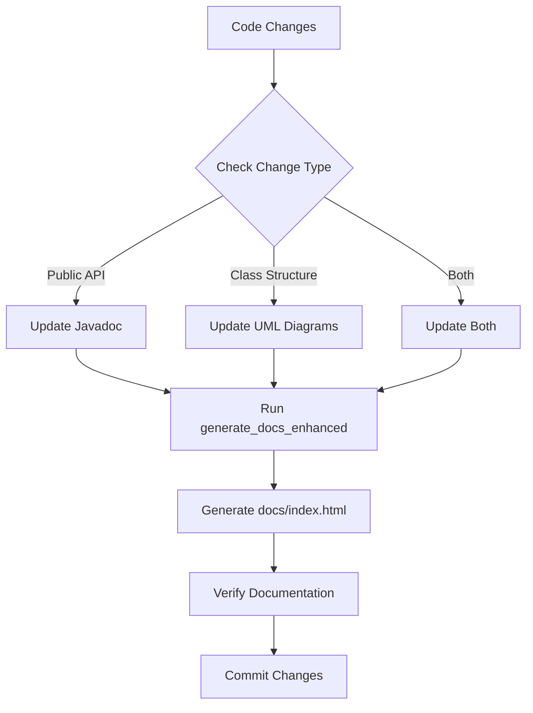

# Documentation Update Guidelines

This document provides guidelines for maintaining and updating documentation in the Splendor project, ensuring that Javadoc and UML diagrams stay synchronized with code changes.

## 📋 Overview

The Splendor project uses an automated documentation system that generates:
- **Javadoc**: API documentation from Java source code comments
- **UML Diagrams**: Visual representations of class relationships and system architecture
- **Documentation Index**: Centralized navigation for all documentation

## 🚀 Quick Start

### For Developers (New to Project)

1. **Before making code changes:**
   ```bash
   # Generate current documentation
   ./generate_docs_enhanced.sh  # Linux/Mac
   # or
   generate_docs_enhanced.bat   # Windows
   ```

2. **After making code changes:**
   ```bash
   # Rebuild and test your changes
   ./compile.sh && ./run_tests.sh
   
   # Update documentation
   ./generate_docs_enhanced.sh
   ```

3. **Check documentation:**
   - Open `docs/index.html` in browser
   - Verify Javadoc reflects your changes
   - Check UML diagrams are updated

### For AI Agents/IDEs

**Always run documentation generation after:**
- Adding new classes or interfaces
- Modifying public method signatures
- Changing class relationships
- Adding new packages
- Updating configuration classes

## 🔄 Automated Documentation Workflow

### 1. Code Changes Trigger
When code is modified, the following should be automatically updated:

#### Javadoc Updates
- Method documentation comments
- Class-level documentation
- Package documentation
- Parameter and return value descriptions
- Exception documentation

#### UML Diagram Updates
- Class relationships (inheritance, composition)
- Package dependencies
- Method signatures
- New/removed classes

### 2. Documentation Generation Process



### 3. Verification Steps

After documentation generation:

1. **Check Javadoc Quality:**
   - No broken links
   - All public methods documented
   - Parameter descriptions complete
   - Return values documented
   - Exceptions properly documented

2. **Check UML Diagrams:**
   - All classes visible
   - Relationships accurate
   - No missing dependencies
   - Diagrams render correctly

3. **Check Documentation Index:**
   - Links work correctly
   - New classes appear
   - Navigation functional

## 📚 Documentation Standards

### Javadoc Standards

#### Class Documentation
```java
/**
 * Brief description of the class purpose.
 * 
 * <p>More detailed description if needed.</p>
 * 
 * <p><strong>Thread Safety:</strong> Document thread safety guarantees</p>
 * 
 * <p><strong>Example Usage:</strong></p>
 * <pre>{@code
 * // Example code showing typical usage
 * MyClass instance = new MyClass();
 * instance.doSomething();
 * }</pre>
 * 
 * @author Your Name
 * @since 1.0
 * @see RelatedClass
 */
public class MyClass {
    // ...
}
```

#### Method Documentation
```java
/**
 * Brief description of what the method does.
 * 
 * <p>Detailed description if needed.</p>
 * 
 * @param param1 Description of first parameter
 * @param param2 Description of second parameter
 * @return Description of return value
 * @throws IllegalArgumentException When parameter validation fails
 * @throws NullPointerException When required parameter is null
 * 
 * @since 1.0
 * @see #relatedMethod()
 */
public ReturnType methodName(Type param1, Type param2) {
    // Implementation
}
```

#### Package Documentation
Create `package-info.java` in each package:
```java
/**
 * Provides classes for [package purpose].
 * 
 * <p>Detailed package description.</p>
 * 
 * <p><strong>Main Classes:</strong></p>
 * <ul>
 *   <li>{@link MainClass} - Primary functionality</li>
 *   <li>{@link HelperClass} - Supporting functionality</li>
 * </ul>
 * 
 * @since 1.0
 */
package com.splendor.package.name;
```

### UML Diagram Standards

#### Class Diagram Conventions
- Use consistent colors for different types (interfaces, enums, classes)
- Show important relationships (inheritance, composition, association)
- Include key methods and attributes
- Group related classes in packages
- Use appropriate layout (hierarchical, orthogonal)

#### Relationship Notations
- **Inheritance**: Solid line with closed arrowhead
- **Implementation**: Dashed line with closed arrowhead
- **Association**: Solid line
- **Composition**: Solid line with filled diamond
- **Aggregation**: Solid line with hollow diamond

## 🤖 AI Agent Guidelines

### When Modifying Code

1. **Before Making Changes:**
   ```
   - Read existing Javadoc for context
   - Understand class relationships
   - Check existing UML diagrams
   - Identify documentation impact
   ```

2. **During Changes:**
   ```
   - Update Javadoc immediately
   - Document new public methods
   - Update class-level documentation
   - Add @since tags for new features
   ```

3. **After Changes:**
   ```
   - Run documentation generation
   - Verify Javadoc completeness
   - Check UML accuracy
   - Test documentation links
   ```

### Common Documentation Patterns

#### Adding New Classes
```java
/**
 * [Brief description].
 * 
 * <p>[Detailed description].</p>
 * 
 * <p><strong>Thread Safety:</strong> [Thread safety notes]</p>
 * 
 * @author [Author Name]
 * @since [Version]
 */
public class NewClass {
    // Always document public constructors
    /**
     * Creates a new instance with [description].
     * 
     * @param param Description
     * @throws ExceptionType When [condition]
     */
    public NewClass(Type param) {
        // Implementation
    }
}
```

#### Modifying Existing Methods
```java
/**
 * [Updated description reflecting changes].
 * 
 * @param existingParam Existing parameter description
 * @param newParam New parameter description (add @since)
 * @return Return value description
 * @throws ExistingException When [condition]
 * @throws NewException When [condition] (add @since)
 * 
 * @since 1.1 - Added newParam parameter and NewException
 */
public ReturnType updatedMethod(Type existingParam, Type newParam) {
    // Updated implementation
}
```

## 🔄 CI/CD Integration

### GitHub Actions Workflow

Create `.github/workflows/documentation.yml`:

```yaml
name: Documentation Update

on:
  push:
    branches: [ main, develop ]
    paths:
      - 'src/**/*.java'
      - 'docs/diagrams/*.puml'
  pull_request:
    branches: [ main ]

jobs:
  update-documentation:
    runs-on: ubuntu-latest
    
    steps:
    - uses: actions/checkout@v3
    
    - name: Set up JDK 17
      uses: actions/setup-java@v3
      with:
        java-version: '17'
        distribution: 'temurin'
    
    - name: Generate Documentation
      run: |
        chmod +x generate_docs_enhanced.sh
        ./generate_docs_enhanced.sh
    
    - name: Check Documentation Changes
      run: |
        if [ -n "$(git status --porcelain docs/)" ]; then
          echo "Documentation changes detected"
          git status --porcelain docs/
        else
          echo "No documentation changes"
        fi
    
    - name: Commit Documentation Updates
      if: github.event_name == 'push' && github.ref == 'refs/heads/main'
      run: |
        git config --local user.email "action@github.com"
        git config --local user.name "GitHub Action"
        git add docs/
        git diff --staged --quiet || git commit -m "docs: auto-update documentation from CI"
        git push
```

### Git Hooks

Create `.git/hooks/pre-commit` (make executable):

```bash
#!/bin/bash
# Pre-commit hook to check documentation

echo "🔍 Checking documentation..."

# Check if Java files were modified
if git diff --cached --name-only | grep -q "\.java$"; then
    echo "📚 Java files modified, checking documentation..."
    
    # Generate documentation
    ./generate_docs_enhanced.sh
    
    # Check if documentation was updated
    if [ -n "$(git status --porcelain docs/)" ]; then
        echo "⚠️  Documentation changes detected. Please review and commit them."
        echo "   Run: git add docs/ && git commit -m 'docs: update documentation'"
        exit 1
    fi
fi

echo "✅ Documentation check complete"
```

## 🧪 Testing Documentation

### Documentation Validation Tests

Create `test/DocumentationTest.java`:

```java
package com.splendor.test;

import org.junit.jupiter.api.Test;
import org.junit.jupiter.api.DisplayName;
import static org.junit.jupiter.api.Assertions.*;

import java.io.File;
import java.nio.file.Files;
import java.nio.file.Path;
import java.nio.file.Paths;

/**
 * Tests for documentation completeness and accuracy.
 */
public class DocumentationTest {
    
    @Test
    @DisplayName("Javadoc files should exist for all public classes")
    void testJavadocFilesExist() {
        // Check that Javadoc HTML files exist
        File javadocDir = new File("docs/javadoc");
        assertTrue(javadocDir.exists(), "Javadoc directory should exist");
        assertTrue(javadocDir.isDirectory(), "Javadoc path should be a directory");
        
        // Check index.html exists
        File indexFile = new File(javadocDir, "index.html");
        assertTrue(indexFile.exists(), "Javadoc index.html should exist");
    }
    
    @Test
    @DisplayName("UML diagrams should exist and be readable")
    void testUmlDiagramsExist() {
        File diagramsDir = new File("docs/diagrams");
        assertTrue(diagramsDir.exists(), "Diagrams directory should exist");
        
        // Check for main diagram files
        String[] expectedDiagrams = {
            "splendor.png",
            "splendor_class_light.png",
            "splendor_dependency.png",
            "splendor_functional.png",
            "splendor_inheritance.png"
        };
        
        for (String diagram : expectedDiagrams) {
            File diagramFile = new File(diagramsDir, diagram);
            assertTrue(diagramFile.exists(), "Diagram " + diagram + " should exist");
            assertTrue(diagramFile.length() > 0, "Diagram " + diagram + " should not be empty");
        }
    }
    
    @Test
    @DisplayName("Documentation index should exist and be valid HTML")
    void testDocumentationIndex() throws Exception {
        Path indexPath = Paths.get("docs/index.html");
        assertTrue(Files.exists(indexPath), "Documentation index should exist");
        
        String content = Files.readString(indexPath);
        assertTrue(content.contains("Splendor Game Documentation"), 
                  "Index should contain title");
        assertTrue(content.contains("javadoc/index.html"), 
                  "Index should link to Javadoc");
        assertTrue(content.contains("diagrams/"), 
                  "Index should link to diagrams");
    }
}
```

## 📊 Documentation Metrics

### Quality Checks

- **Javadoc Coverage**: Aim for 100% public API documentation
- **Method Documentation**: All public methods must have Javadoc
- **Parameter Coverage**: All parameters must be documented
- **Exception Documentation**: All thrown exceptions must be documented
- **Diagram Accuracy**: UML diagrams must reflect current code structure

### Monitoring

Track documentation health:
- Number of undocumented public methods
- Javadoc warnings during generation
- Broken links in documentation
- Outdated UML diagrams

## 🆘 Troubleshooting

### Common Issues

#### Javadoc Generation Fails
```bash
# Check Java installation
java -version
javadoc -help

# Check source path
ls -la src/com/splendor/

# Run with verbose output
javadoc -verbose -d docs/javadoc -sourcepath src -subpackages com.splendor
```

#### UML Diagrams Not Updating
```bash
# Check PlantUML installation
ls -la docs/diagrams/plantuml.jar

# Test PlantUML directly
java -jar docs/diagrams/plantuml.jar docs/diagrams/splendor.puml

# Check diagram syntax
java -jar docs/diagrams/plantuml.jar -checkonly docs/diagrams/*.puml
```

#### Documentation Links Broken
```bash
# Check file permissions
ls -la docs/

# Validate HTML
# Use online HTML validator or browser developer tools

# Check relative paths
# Ensure all links use relative paths for portability
```

### Getting Help

1. **Check existing documentation**: Review this guide and existing docs
2. **Run validation tests**: Use the provided test suite
3. **Check build logs**: Look for specific error messages
4. **Verify file permissions**: Ensure scripts are executable
5. **Test incrementally**: Generate documentation for specific packages first

## 📚 Additional Resources

- [Oracle Javadoc Guide](https://docs.oracle.com/en/java/javase/17/docs/specs/javadoc/javadoc-spec.html)
- [PlantUML Documentation](https://plantuml.com/)
- [Java Documentation Best Practices](https://www.oracle.com/technical-resources/articles/java/javadoc-tool.html)
- [UML Diagram Guidelines](https://www.uml-diagrams.org/)

---

**Remember**: Good documentation is as important as good code. Keep it updated, accurate, and accessible! 🚀