# Splendor Class Diagram (UML Class Diagram)

This document contains the complete UML class diagrams for the Splendor board game implementation, showing the refactored package structure and relationships between classes.

## System Architecture Overview

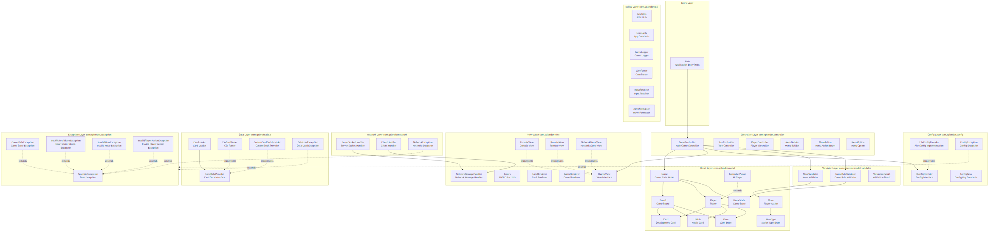

## Detailed Class Diagrams

### 1. Core Model Package (com.splendor.model)

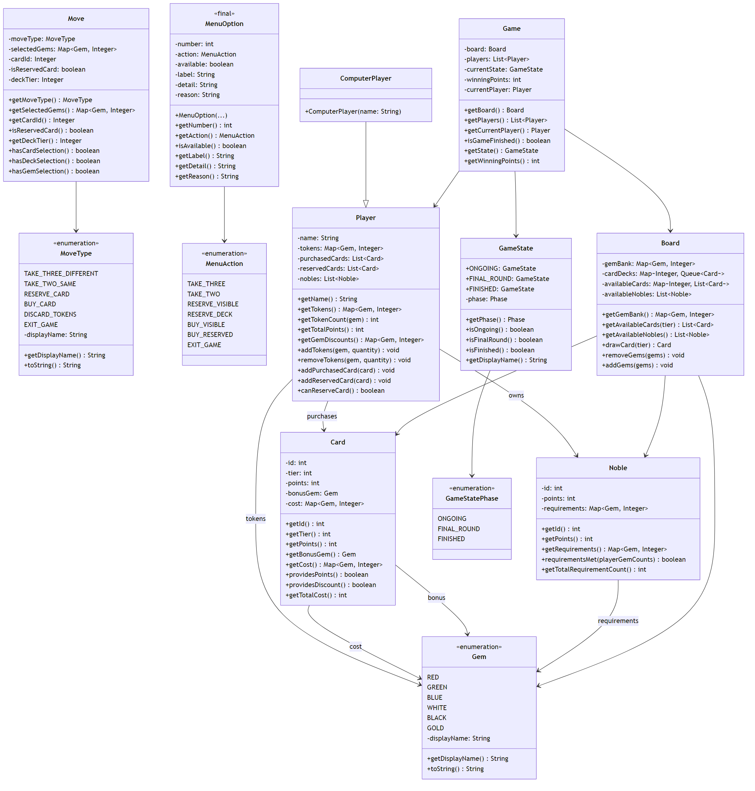

### 2. Controller Package (com.splendor.controller)

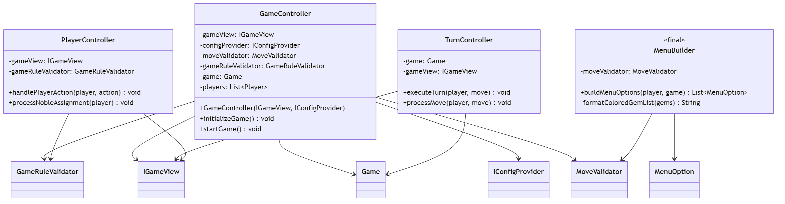

### 3. View Package (com.splendor.view)

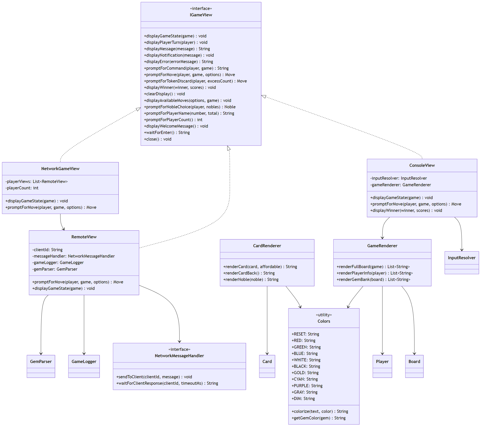

### 4. Data Loading Package (com.splendor.data)

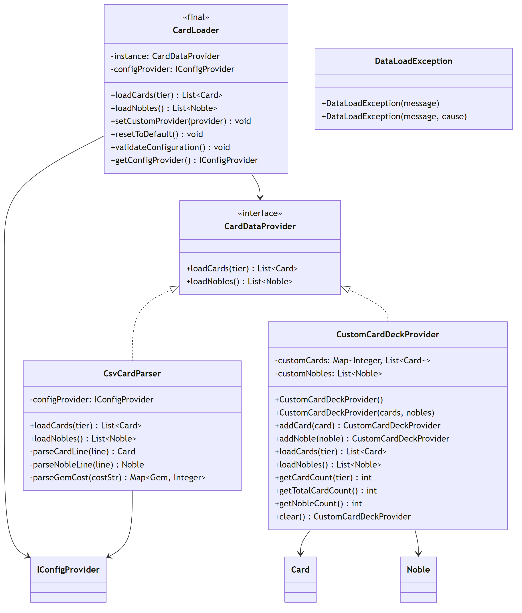

### 5. Validator Package (com.splendor.model.validator)

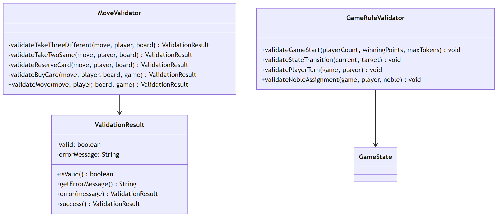

### 6. Config Package (com.splendor.config)

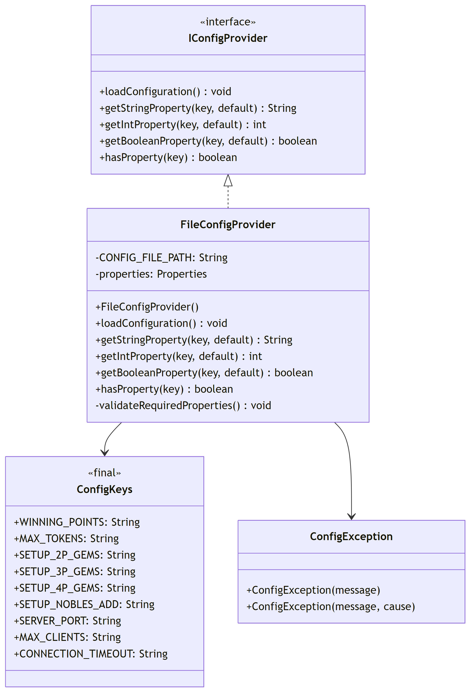

### 7. Network Package (com.splendor.network)

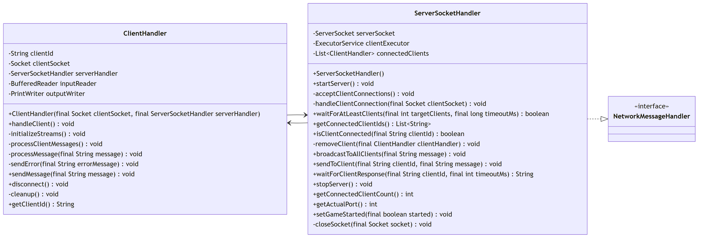

### 8. Utility Package (com.splendor.util)

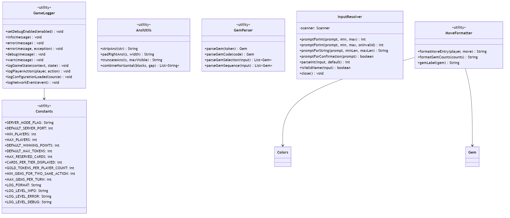

### 9. Exception Hierarchy (com.splendor.exception)

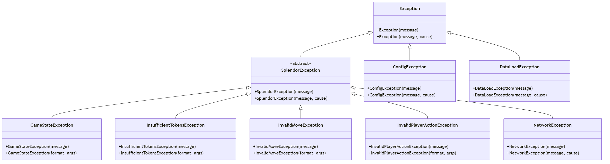

## Package Dependencies

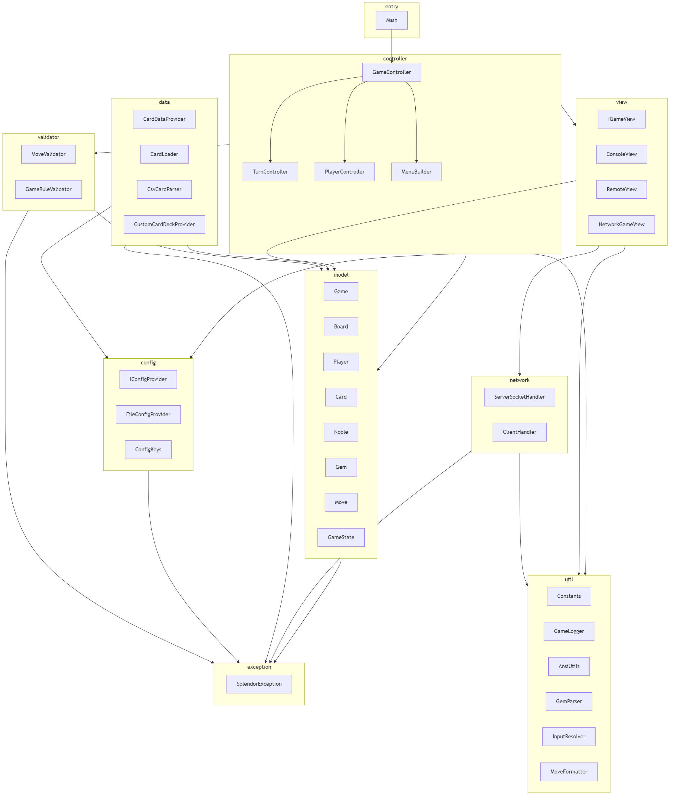

## Design Patterns

This implementation uses the following design patterns:

1. **MVC Pattern**: Clear Model-View-Controller separation
2. **Strategy Pattern**: `BotStrategy` for AI player decision-making
3. **Factory Pattern**: `MenuBuilder` builds menu options
4. **Singleton Pattern**: `GameState` uses predefined instances
5. **Dependency Injection**: Through `IConfigProvider` and `IGameView` interfaces
6. **Template Method**: `CardDataProvider` defines data loading contract
7. **Facade Pattern**: `CardLoader` simplifies data loading API
8. **Validator Pattern**: `MoveValidator` and `GameRuleValidator` separate validation logic

## Data Flow

### Game Initialization Flow

```
Main.main()
  → FileConfigProvider.loadConfiguration()
  → ConfigValidator.validateAll()
  → GameController.initializeGame()
    → Prompt for player count
    → Create Player/ComputerPlayer instances
    → CardLoader.loadCards() / loadNobles()
    → Initialize Board
  → GameController.startGame()
```

### Turn Execution Flow

```
GameController.startGame()
  → Loop until game ends:
    → TurnController.executeTurn()
      → ConsoleView.promptForMove()
      → MoveValidator.validateMove()
      → Execute action
      → Check noble cards
      → Check win condition
```

---

*Documentation generated: 2026-03-31*
*Based on refactored Splendor codebase*
