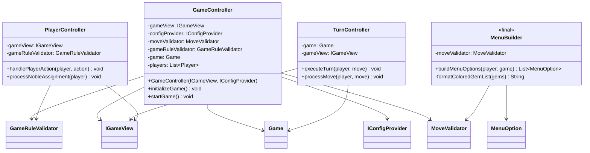
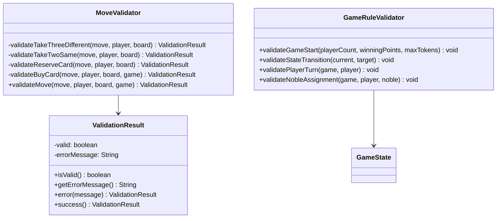
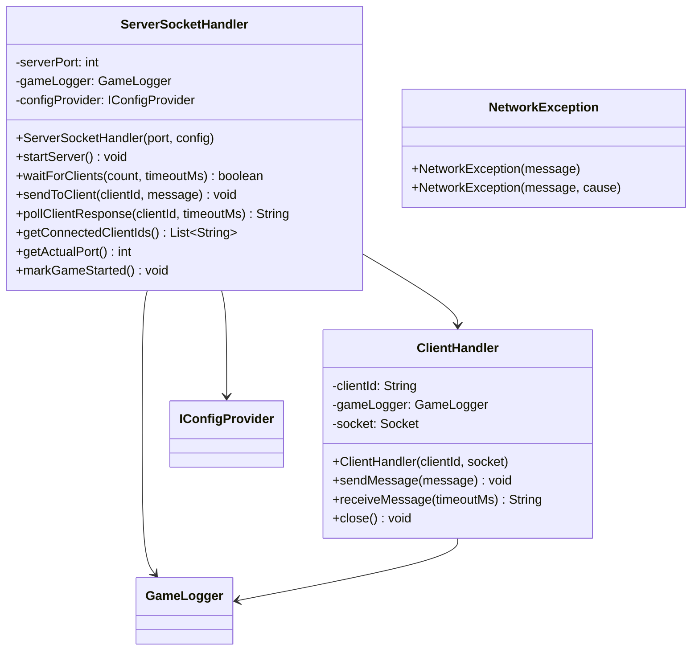
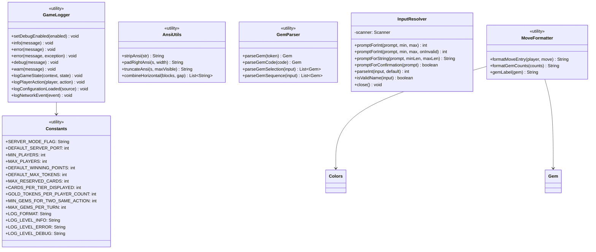
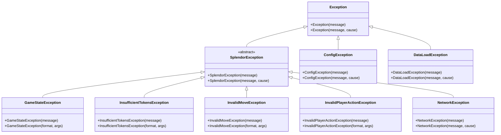
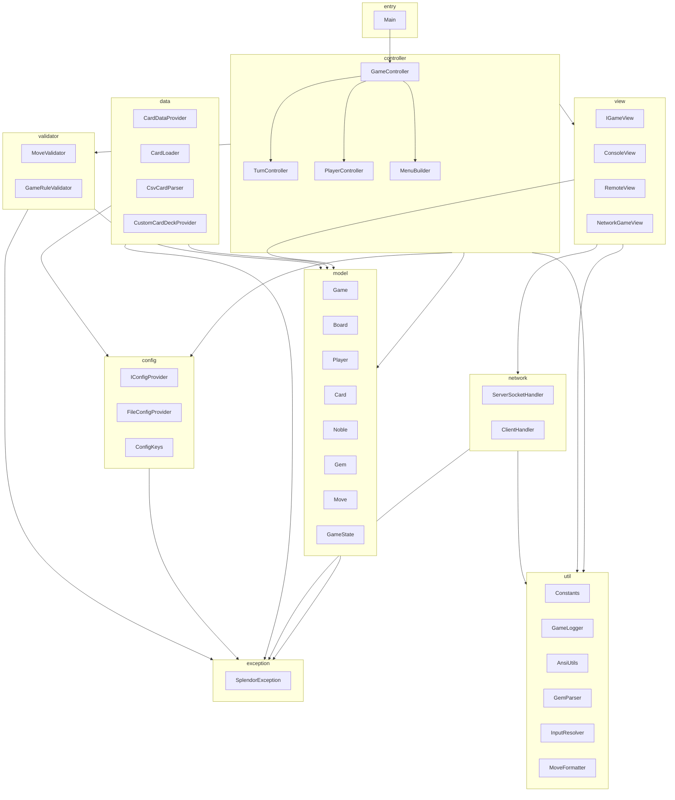

# Splendor Class Diagram (UML Class Diagram)

This document contains the complete UML class diagrams for the Splendor board game implementation, showing the refactored package structure and relationships between classes.

## System Architecture Overview

```mermaid
flowchart TB
    subgraph Entry["Entry Layer"]
        Main["Main<br/>Application Entry Point"]
    end
    
    subgraph Config["Config Layer com.splendor.config"]
        IConfigProvider["IConfigProvider<br/>Config Interface"]
        FileConfigProvider["FileConfigProvider<br/>File Config Implementation"]
        ConfigKeys["ConfigKeys<br/>Config Key Constants"]
        ConfigException["ConfigException<br/>Config Exception"]
    end
    
    subgraph Controller["Controller Layer com.splendor.controller"]
        GameController["GameController<br/>Main Game Controller"]
        TurnController["TurnController<br/>Turn Controller"]
        PlayerController["PlayerController<br/>Player Controller"]
        MenuBuilder["MenuBuilder<br/>Menu Builder"]
        MenuAction["MenuAction<br/>Menu Action Enum"]
        MenuOption["MenuOption<br/>Menu Option"]
    end
    
    subgraph Model["Model Layer com.splendor.model"]
        Game["Game<br/>Game State Model"]
        Board["Board<br/>Game Board"]
        Player["Player<br/>Player"]
        ComputerPlayer["ComputerPlayer<br/>AI Player"]
        Card["Card<br/>Development Card"]
        Noble["Noble<br/>Noble Card"]
        Gem["Gem<br/>Gem Enum"]
        Move["Move<br/>Player Action"]
        MoveType["MoveType<br/>Action Type Enum"]
        GameState["GameState<br/>Game State"]
    end
    
    subgraph Validator["Validator Layer com.splendor.model.validator"]
        MoveValidator["MoveValidator<br/>Move Validator"]
        GameRuleValidator["GameRuleValidator<br/>Game Rule Validator"]
        ValidationResult["ValidationResult<br/>Validation Result"]
    end
    
    subgraph View["View Layer com.splendor.view"]
        IGameView["IGameView<br/>View Interface"]
        ConsoleView["ConsoleView<br/>Console View"]
        RemoteView["RemoteView<br/>Remote View"]
        NetworkGameView["NetworkGameView<br/>Network Game View"]
        Colors["Colors<br/>ANSI Color Utils"]
        CardRenderer["CardRenderer<br/>Card Renderer"]
        GameRenderer["GameRenderer<br/>Game Renderer"]
        NetworkMessageHandler["NetworkMessageHandler<br/>Network Message Handler"]
    end
    
    subgraph Network["Network Layer com.splendor.network"]
        ServerSocketHandler["ServerSocketHandler<br/>Server Socket Handler"]
        ClientHandler["ClientHandler<br/>Client Handler"]
        NetworkException["NetworkException<br/>Network Exception"]
    end
    
    subgraph Data["Data Layer com.splendor.data"]
        CardDataProvider["CardDataProvider<br/>Card Data Interface"]
        CardLoader["CardLoader<br/>Card Loader"]
        CsvCardParser["CsvCardParser<br/>CSV Parser"]
        CustomCardDeckProvider["CustomCardDeckProvider<br/>Custom Deck Provider"]
        DataLoadException["DataLoadException<br/>Data Load Exception"]
    end
    
    subgraph Util["Utility Layer com.splendor.util"]
        AnsiUtils["AnsiUtils<br/>ANSI Utils"]
        Constants["Constants<br/>App Constants"]
        GameLogger["GameLogger<br/>Game Logger"]
        GemParser["GemParser<br/>Gem Parser"]
        InputResolver["InputResolver<br/>Input Resolver"]
        MoveFormatter["MoveFormatter<br/>Move Formatter"]
    end
    
    subgraph Exception["Exception Layer com.splendor.exception"]
        SplendorException["SplendorException<br/>Base Exception"]
        GameStateException["GameStateException<br/>Game State Exception"]
        InsufficientTokensException["InsufficientTokensException<br/>Insufficient Tokens Exception"]
        InvalidMoveException["InvalidMoveException<br/>Invalid Move Exception"]
        InvalidPlayerActionException["InvalidPlayerActionException<br/>Invalid Player Action Exception"]
    end
    
    Main --> GameController
    GameController --> Game
    GameController --> IGameView
    GameController --> IConfigProvider
    GameController --> MoveValidator
    GameController --> GameRuleValidator
    
    FileConfigProvider ..|> IConfigProvider
    ConsoleView ..|> IGameView
    RemoteView ..|> IGameView
    NetworkGameView ..|> IGameView
    
    CsvCardParser ..|> CardDataProvider
    CustomCardDeckProvider ..|> CardDataProvider
    CardLoader --> CardDataProvider
    
    Game --> Board
    Game --> Player
    Game --> GameState
    Board --> Card
    Board --> Noble
    Board --> Gem
    Player --> Card
    Player --> Noble
    Player --> Gem
    Move --> MoveType
    ComputerPlayer --|> Player
    
    GameRuleValidator --> GameState
    MoveValidator --> Move
    
    ServerSocketHandler --> NetworkMessageHandler
    ClientHandler --> NetworkMessageHandler
    
    GameStateException --|> SplendorException
    InsufficientTokensException --|> SplendorException
    InvalidMoveException --|> SplendorException
    InvalidPlayerActionException --|> SplendorException
    NetworkException --|> SplendorException
    ConfigException --|> Exception
    DataLoadException --|> Exception
```

## Detailed Class Diagrams

### 1. Core Model Package (com.splendor.model)

```mermaid
classDiagram
    class Gem {
        <<enumeration>>
        RED
        GREEN
        BLUE
        WHITE
        BLACK
        GOLD
        -displayName: String
        +getDisplayName() String
        +toString() String
    }
    
    class MoveType {
        <<enumeration>>
        TAKE_THREE_DIFFERENT
        TAKE_TWO_SAME
        RESERVE_CARD
        BUY_CARD
        DISCARD_TOKENS
        EXIT_GAME
        -displayName: String
        +getDisplayName() String
        +toString() String
    }
    
    class MenuAction {
        <<enumeration>>
        TAKE_THREE
        TAKE_TWO
        RESERVE_VISIBLE
        RESERVE_DECK
        BUY_VISIBLE
        BUY_RESERVED
        EXIT_GAME
    }
    
    class MenuOption {
        <<final>>
        -number: int
        -action: MenuAction
        -available: boolean
        -label: String
        -detail: String
        -reason: String
        +MenuOption(...) 
        +getNumber() int
        +getAction() MenuAction
        +isAvailable() boolean
        +getLabel() String
        +getDetail() String
        +getReason() String
    }
    
    class Card {
        -id: int
        -tier: int
        -points: int
        -bonusGem: Gem
        -cost: Map~Gem, Integer~
        +getId() int
        +getTier() int
        +getPoints() int
        +getBonusGem() Gem
        +getCost() Map~Gem, Integer~
        +providesPoints() boolean
        +providesDiscount() boolean
        +getTotalCost() int
    }
    
    class Noble {
        -id: int
        -points: int
        -requirements: Map~Gem, Integer~
        +getId() int
        +getPoints() int
        +getRequirements() Map~Gem, Integer~
        +requirementsMet(playerGemCounts) boolean
        +getTotalRequirementCount() int
    }
    
    class Player {
        -name: String
        -tokens: Map~Gem, Integer~
        -purchasedCards: List~Card~
        -reservedCards: List~Card~
        -nobles: List~Noble~
        +getName() String
        +getTokens() Map~Gem, Integer~
        +getTokenCount(gem) int
        +getTotalPoints() int
        +getGemDiscounts() Map~Gem, Integer~
        +addTokens(gem, quantity) void
        +removeTokens(gem, quantity) void
        +addPurchasedCard(card) void
        +addReservedCard(card) void
        +canReserveCard() boolean
    }
    
    class ComputerPlayer {
        +ComputerPlayer(name: String)
    }
    
    class Move {
        -moveType: MoveType
        -selectedGems: Map~Gem, Integer~
        -cardId: Integer
        -isReservedCard: boolean
        -deckTier: Integer
        +getMoveType() MoveType
        +getSelectedGems() Map~Gem, Integer~
        +getCardId() Integer
        +isReservedCard() boolean
        +getDeckTier() Integer
        +hasCardSelection() boolean
        +hasDeckSelection() boolean
        +hasGemSelection() boolean
    }
    
    class GameState {
        +ONGOING: GameState
        +FINAL_ROUND: GameState
        +FINISHED: GameState
        -phase: Phase
        +getPhase() Phase
        +isOngoing() boolean
        +isFinalRound() boolean
        +isFinished() boolean
        +getDisplayName() String
    }
    
    GameState.Phase {
        <<enumeration>>
        ONGOING
        FINAL_ROUND
        FINISHED
    }
    
    class Board {
        -gemBank: Map~Gem, Integer~
        -cardDecks: Map~Integer, Queue~Card~~
        -availableCards: Map~Integer, List~Card~~
        -availableNobles: List~Noble~
        +getGemBank() Map~Gem, Integer~
        +getAvailableCards(tier) List~Card~
        +getAvailableNobles() List~Noble~
        +drawCard(tier) Card
        +removeGems(gems) void
        +addGems(gems) void
    }
    
    class Game {
        -board: Board
        -players: List~Player~
        -currentState: GameState
        -winningPoints: int
        -currentPlayer: Player
        +getBoard() Board
        +getPlayers() List~Player~
        +getCurrentPlayer() Player
        +isGameFinished() boolean
        +getState() GameState
        +getWinningPoints() int
    }
    
    ComputerPlayer --|> Player
    Player --> Card : purchases
    Player --> Noble : owns
    Player --> Gem : tokens
    Card --> Gem : cost
    Card --> Gem : bonus
    Noble --> Gem : requirements
    Move --> MoveType
    MenuOption --> MenuAction
    Game --> Board
    Game --> Player
    Game --> GameState
    Board --> Card
    Board --> Noble
    Board --> Gem
    GameState --> GameState.Phase
```

### 2. Controller Package (com.splendor.controller)



### 3. View Package (com.splendor.view)

```mermaid
classDiagram
    interface IGameView {
        +displayGameState(game) void
        +displayPlayerTurn(player) void
        +displayMessage(message) String
        +displayNotification(message) void
        +displayError(errorMessage) String
        +promptForCommand(player, game) String
        +promptForMove(player, game, options) Move
        +promptForTokenDiscard(player, excessCount) Move
        +displayWinner(winner, scores) void
        +clearDisplay() void
        +displayAvailableMoves(options, game) void
        +promptForNobleChoice(player, nobles) Noble
        +promptForPlayerName(number, total) String
        +promptForPlayerCount() int
        +displayWelcomeMessage() void
        +waitForEnter() String
        +close() void
    }
    
    class ConsoleView {
        -inputResolver: InputResolver
        -gameRenderer: GameRenderer
        +displayGameState(game) void
        +promptForMove(player, game, options) Move
        +displayWinner(winner, scores) void
    }
    
    class RemoteView {
        -clientId: String
        -messageHandler: NetworkMessageHandler
        -gameLogger: GameLogger
        -gemParser: GemParser
        +promptForMove(player, game, options) Move
        +displayGameState(game) void
    }
    
    class NetworkGameView {
        -playerViews: List~RemoteView~
        -playerCount: int
        +displayGameState(game) void
        +promptForMove(player, game, options) Move
    }
    
    class Colors {
        <<utility>>
        +RESET: String
        +RED: String
        +GREEN: String
        +BLUE: String
        +WHITE: String
        +BLACK: String
        +GOLD: String
        +CYAN: String
        +PURPLE: String
        +GRAY: String
        +DIM: String
        +colorize(text, color) String
        +getGemColor(gem) String
    }
    
    class CardRenderer {
        +renderCard(card, affordable) String
        +renderCardBack() String
        +renderNoble(noble) String
    }
    
    class GameRenderer {
        +renderFullBoard(game) List~String~
        +renderPlayerInfo(player) List~String~
        +renderGemBank(board) List~String~
    }
    
    class NetworkMessageHandler {
        <<interface>>
        +sendToClient(clientId, message) void
        +waitForClientResponse(clientId, timeoutMs) String
    }
    
    IGameView <|.. ConsoleView
    IGameView <|.. RemoteView
    IGameView <|.. NetworkGameView
    ConsoleView --> InputResolver
    ConsoleView --> GameRenderer
    RemoteView --> NetworkMessageHandler
    RemoteView --> GameLogger
    RemoteView --> GemParser
    NetworkGameView --> RemoteView
    CardRenderer --> Colors
    CardRenderer --> Card
    GameRenderer --> Board
    GameRenderer --> Player
    GameRenderer --> Colors
```

### 4. Data Loading Package (com.splendor.data)

```mermaid
classDiagram
    interface CardDataProvider {
        +loadCards(tier) List~Card~
        +loadNobles() List~Noble~
    }
    
    class CardLoader {
        <<final>>
        -instance: CardDataProvider
        -configProvider: IConfigProvider
        +loadCards(tier) List~Card~
        +loadNobles() List~Noble~
        +setCustomProvider(provider) void
        +resetToDefault() void
        +validateConfiguration() void
        +getConfigProvider() IConfigProvider
    }
    
    class CsvCardParser {
        -configProvider: IConfigProvider
        +loadCards(tier) List~Card~
        +loadNobles() List~Noble~
        -parseCardLine(line) Card
        -parseNobleLine(line) Noble
        -parseGemCost(costStr) Map~Gem, Integer~
    }
    
    class CustomCardDeckProvider {
        -customCards: Map~Integer, List~Card~~
        -customNobles: List~Noble~
        +CustomCardDeckProvider()
        +CustomCardDeckProvider(cards, nobles)
        +addCard(card) CustomCardDeckProvider
        +addNoble(noble) CustomCardDeckProvider
        +loadCards(tier) List~Card~
        +loadNobles() List~Noble~
        +getCardCount(tier) int
        +getTotalCardCount() int
        +getNobleCount() int
        +clear() CustomCardDeckProvider
    }
    
    class DataLoadException {
        +DataLoadException(message)
        +DataLoadException(message, cause)
    }
    
    CardDataProvider <|.. CsvCardParser
    CardDataProvider <|.. CustomCardDeckProvider
    CardLoader --> CardDataProvider
    CardLoader --> IConfigProvider
    CsvCardParser --> IConfigProvider
    CustomCardDeckProvider --> Card
    CustomCardDeckProvider --> Noble
```

### 5. Validator Package (com.splendor.model.validator)



### 6. Config Package (com.splendor.config)

```mermaid
classDiagram
    interface IConfigProvider {
        +loadConfiguration() void
        +getStringProperty(key, default) String
        +getIntProperty(key, default) int
        +getBooleanProperty(key, default) boolean
        +hasProperty(key) boolean
    }
    
    class FileConfigProvider {
        -CONFIG_FILE_PATH: String
        -properties: Properties
        +FileConfigProvider()
        +loadConfiguration() void
        +getStringProperty(key, default) String
        +getIntProperty(key, default) int
        +getBooleanProperty(key, default) boolean
        +hasProperty(key) boolean
        -validateRequiredProperties() void
    }
    
    class ConfigKeys {
        <<final>>
        +WINNING_POINTS: String
        +MAX_TOKENS: String
        +SETUP_2P_GEMS: String
        +SETUP_3P_GEMS: String
        +SETUP_4P_GEMS: String
        +SETUP_NOBLES_ADD: String
        +SERVER_PORT: String
        +MAX_CLIENTS: String
        +CONNECTION_TIMEOUT: String
    }
    
    class ConfigException {
        +ConfigException(message)
        +ConfigException(message, cause)
    }
    
    IConfigProvider <|.. FileConfigProvider
    FileConfigProvider --> ConfigKeys
    FileConfigProvider --> ConfigException
```

### 7. Network Package (com.splendor.network)



### 8. Utility Package (com.splendor.util)



### 9. Exception Hierarchy (com.splendor.exception)



## Package Dependencies



## Design Patterns

This implementation uses the following design patterns:

1. **MVC Pattern**: Clear Model-View-Controller separation
2. **Strategy Pattern**: `BotStrategy` for AI player decision-making
3. **Factory Pattern**: `MenuBuilder` builds menu options
4. **Singleton Pattern**: `GameState` uses predefined instances
5. **Dependency Injection**: Through `IConfigProvider` and `IGameView` interfaces
6. **Template Method**: `CardDataProvider` defines data loading contract
7. **Facade Pattern**: `CardLoader` simplifies data loading API
8. **Validator Pattern**: `MoveValidator` and `GameRuleValidator` separate validation logic

## Data Flow

### Game Initialization Flow

```
Main.main()
  → FileConfigProvider.loadConfiguration()
  → ConfigValidator.validateAll()
  → GameController.initializeGame()
    → Prompt for player count
    → Create Player/ComputerPlayer instances
    → CardLoader.loadCards() / loadNobles()
    → Initialize Board
  → GameController.startGame()
```

### Turn Execution Flow

```
GameController.startGame()
  → Loop until game ends:
    → TurnController.executeTurn()
      → ConsoleView.promptForMove()
      → MoveValidator.validateMove()
      → Execute action
      → Check noble cards
      → Check win condition
```

---

*Documentation generated: 2026-03-31*
*Based on refactored Splendor codebase*
